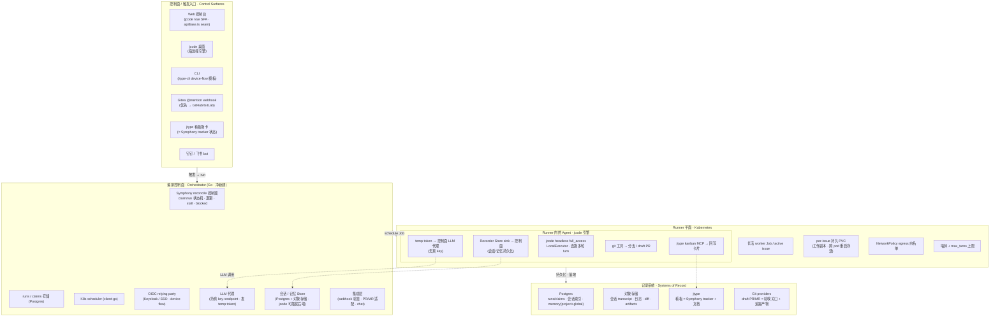

# 01 · 架构

## 生态现状:每个仓库贡献什么

**jcode（Go）= agent 大脑 + runner 原型。** 已经具备云端 runner 需要的大部分原语:

- `internal/runner/{runner.go,approval.go}` —— 单轮 agent loop + approval 模式(含 `full_access` 全自动模式)。
- `internal/remote/{docker.go,ssh.go}` + `internal/tools/env.go` —— 工具执行抽象在 `Executor` 接口之后,已有 Local / SSH / Docker 三种实现;换 executor 就换整个工具面。
- `internal/session/session.go` —— `Recorder` 把每个事件落 JSONL(`~/.jcode/sessions/{uuid}.json`),可 `ReconstructState` 序列化/resume。
- `internal/memory/` —— 已有 **project** 与 **global(跨项目)** 两个 scope,`inject.go` 每次调用前注入,`memory sync` 蒸馏 pipeline 从会话提炼。
- `internal/web/automation_run.go` —— **真正的 headless 路径**:一个"throwaway headless Engine,强制 `full_access`(headless approvals would hang)"。
- `internal/config/config.go` + `internal/model/factory.go` —— BYO OpenAI 兼容 provider(`api_key`/`base_url`/headers/custom_models)。
- `internal/web/server.go` —— 已能并发跑多个隔离 Engine、bearer-token 鉴权。
- ⚠️ 注意:裸 `jcode` / `jcode -p` 仍走 `cmd/jcode/main.go` 的 `RunInteractive`(会 boot TUI);headless 面是 web/acp/automation。

**jtype（Rust/Axum + React）= 现成的多租户控制面数据层。** `services/jtype-web` 的 migrations 已包含:`users` / `workspaces` / `workspace_members`(owner/admin/editor/viewer)/ `workspace_invites`;OAuth 2.1 **device flow + PKCE authcode + 动态客户端注册**、可撤销带 scope 的 `sessions` token;**出站 webhook 引擎**(`webhooks` + `webhook_deliveries`,HMAC + 重试/退避);Jira 式 `card_tickets`(稳定 ID 如 `OCCSV-3371`)+ `board_sequences`;`sites`/`custom_domains`(发布);`workspace_sync_cursors`/`sync_conflicts`(local-first 同步);`src/hub.rs`(WebSocket)、`src/storage.rs`(S3 兼容对象存储)、`src/mcp/*`(看板/笔记 MCP 工具)。依赖:MySQL + S3 兼容对象存储(RustFS/MinIO)+ SMTP。已有 `helm/jtype-web`。

**jbrowser（Rust）= runner control-plane 模板。** outbound-agent 拨号控制面、注册、心跳、从不暴露端口 + Helm 部署到 K8s——是"控制面 ↔ runner"拆分的现成范式。

---

## 一句话架构

> 一个 **Go orchestrator**(= Kubernetes 风格的 **Symphony 控制器**)把 **jtype 看板**当作 tracker,reconcile 出一批**长活 worker Job**;每个 Job 里跑 **jcode headless**,本地改代码、开 **draft PR**、用 **jtype MCP** 自己回写卡片;人工在 PR 上把关。**K8s 替掉了 Symphony 的 Elixir**,jcode 提供 agent,jtype 提供控制面数据,jbrowser 提供 K8s 模板。

---

## 平面架构图（自上而下 = 触发 → 落地）

---

## 组件长自哪里

| 组件 | 长自 | 职责 |
|---|---|---|
| **Orchestrator（控制面）** | 净新建 · Go · client-go | OIDC RP、Symphony reconcile 控制器、project↔repo 配置、run API、K8s 调度;复用 jcode 的 `config/model/session` 包 |
| **Run 存储 + 事件** | Postgres + jtype `src/storage.rs` | runs/claims/run_events 落库;日志/diff/transcript 进对象存储;幂等 reconcile 恢复 |
| **Runner 调度器** | jbrowser control-plane 模式 + `helm/` | client-go 持 ServiceAccount,为每个 active issue 起/复用长活 worker Job;限额、NetworkPolicy、墙钟 |
| **Runner 镜像** | jcode `jcode_headless` + Codex `codex-universal` 参考 | 多语言基座(Go/Java/Python/Node,env-var 选版本)+ jcode headless 入口;两段式 SETUP→AGENT |
| **Agent 引擎（runner 内）** | jcode `internal/runner` + LocalExecutor | pod 即沙箱,agent 本地跑;Store sink 回传会话;调 jtype MCP + git 工具自己开 PR;LLM 走控制面代理 |
| **LLM 代理** | 净新建(控制面内) | 持真 BYOK key+endpoint;按 run 签发 temp token;集中限流/计量/轮换 |
| **集成层** | jtype webhook worker + `src/mcp/*` | 入站:Gitea/GitHub/GitLab 验签 + @mention 派发、钉钉/飞书;出站:PR/MR、卡片回写、状态卡 |
| **身份 / 租户** | 外部 OIDC(Keycloak/SSO) | orchestrator 作 RP;device flow 给 runner/CLI;OIDC org/group → tenant/project |
| **控制面前端** | jcode Vue SPA · `apiBase.ts` · jcode-design | Web 控制台;桌面 jcode 经 seam 指远端;CLI、PR、看板、chat 皆原生入口 |

---

## 端到端生命周期

Symphony 的 reconcile 语义 + K8s 的调度/监督,合成一条流水线:

1. **TRIGGER —— 触发 → 归一为 run。** 卡片进触发列 / Gitea @mention webhook / 控制台 Run / 钉钉·飞书指令。orchestrator 认证(OIDC 会话或 webhook 验签),把 issue 或请求归一成一个 run 记录(Postgres)。
2. **RECONCILE —— 控制器对账。** controller 轮询看板(Symphony `active_states`)+ DB;对每个 eligible 且未 claimed 的 active issue,claim 它并确保存在一个 worker——遵守全局/按列并发上限、优先级排序、`Todo` blocker 规则。
3. **SCHEDULE —— 起/复用 worker Job。** client-go 起或复用一个长活 worker Job,挂上 per-issue PVC,注入 run-scoped token + repo URL + 访问 LLM 代理的短期 temp token。
4. **SETUP —— 准备 workspace(网络开)。** worker 在 PVC 里 clone/更新 repo,跑项目 setup 脚本(可装依赖);从控制面 Store 拉取该 `(tenant, project)` + `global` memory 到工作副本。随后落入 agent 阶段,egress 收敛到白名单。
5. **AGENT ×N —— 连跑多轮 turn。** jcode headless `full_access` + LocalExecutor 在 sandbox 内本地跑;**LLM 调用一律经控制面 LLM 代理(temp token,无真 key)**。在同一 thread/workspace 连跑多轮(到 `max_turns`/墙钟);会话经可插拔 Store sink 落控制面(实时事件另走 `AgentEventHandler` 给 UI);增量 commit;用 jtype kanban MCP 自己 `report_progress` 回写卡片。
6. **BLOCKED —— 需人工时不空转。** 若需人工输入/审批,保持 `claimed`,在 state / API / 看板上暴露成 `blocked`——绝不永久 stall(Symphony 一等公民语义)。
7. **FINALIZE —— 推分支 · 开 draft PR · 蒸馏记忆。** 推 namespaced 分支(`agent/*`),开/更新 draft PR/MR(= 验收关口 + 追踪产物);run → `needs_review`;卡片 → review;chat 发状态卡。**控制面侧(可信)从本 run 会话蒸馏 memory 写回 Store**——不让不可信 sandbox 直接写共享记忆。
8. **GATE & LOOP —— 人工把关 · 回收。** 人工 review(不自动 merge、不自动 CI);review @mention 触发同分支新一轮。issue 离开 active → worker 退出、reconcile 释放 claim、按策略回收 PVC。stall/crash → 指数退避重试,K8s 重排。
