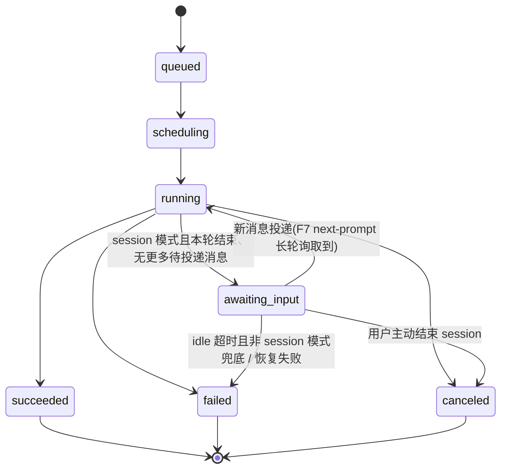

# 14 · Cloud v2 设计 — 对标 Claude Code 云端形态

> 状态:设计草案(2026-07-08)。收敛 [02-decision-log.md](02-decision-log.md) 里"补充 —— Cloud v2 设计"一节的 D18–D26 为一份可施工的设计;里程碑落地顺序见 §7。本文是设计快照,冲突时以 `02-decision-log.md` 里时间戳最新的条目为准。
>
> 前置状态:[13-multitenant-blueprint.md](13-multitenant-blueprint.md) 的 M1–M6(project/service/OAuth/RBAC/PR review)已全部落地。本文档描述在其之上的下一轮迭代。

---

## 0 · 目标

**对标对象**:Claude Code 的云端 agent 体验——发一条消息就开始干活;可以继续对话而不是每次重开;agent 给一句纯文本回答本身就是有效产出,不是"没干活";断线、休眠之后能带着上下文恢复,而不是每次从 clone 重来。

**当前 gap**(M1–M6 完成之后):

- run 是"一次性单轮 headless 调用",空 diff 被误判成失败——发一句 "hi" 就看到一条红色 failed run。
- 没有"给正在跑/等着的 run 发下一条消息"的入口;每个想法都要开一条新 run,上下文丢光。
- git 凭据与模型配置仍是 project/cluster 单点(单条 `cluster_model_config`、project 上的个人 OAuth 触发路径),不支持团队规模化后的授权与自助。
- kanban 是唯一的"卡片式"触发面,管理权在 cluster-admin,project owner 自己配不了;schedule、通用 webhook、project 级自动化凭证都还没有。

**本期非目标**(不在 D18–D26 范围内,明确不做):

- 不做多 agent 编排 / agent 间协作。
- 不做跨 project 的模型市场或按任务类型的模型矩阵(D21 明确选了 simple select)。
- 不做 fine-grained per-repo RBAC——权限粒度仍停在 project 级(project_members 的 owner/member/viewer)。
- 不把 jcode 桌面端实际迁到 React——D26 本期只落一个模块边界(`console/src/runview/`),迁移是分期的终局,不是本轮交付物。

---

## 1 · 实体模型变化

### 1.1 integration(D19)

新表 `integrations`,project 级,owner 可增删:

```sql
integrations(
  id           uuid pk,
  project_id   uuid not null references projects(id) on delete cascade,
  name         text not null default 'default',
  provider     text not null check (provider in ('gitea','github','gitlab')),
  host         text not null,               -- gitea.jcloud.svc.cluster.local / github.com / gitlab.com
  cred_type    text not null default 'pat' check (cred_type in ('pat','github_app')),
                                             -- 抽象位:github 先落 pat,github_app 是将来扩展槽,今天不实现
  token_enc    bytea not null,              -- AES-256-GCM(AUTH_TOKEN_KEY);org 级服务凭据,不可回读明文
  created_by   uuid references users(id),
  created_at   timestamptz not null default now(),
  updated_at   timestamptz not null default now(),
  unique(project_id, name)
)

services: + integration_id uuid null references integrations(id)
          -- null = 存量 service,继续走触发者个人 OAuth 路径(兼容,不强制迁移)
```

- 凭据是 **org/group 级**(Gitea org PAT、GitLab group token),不是 per-repo;一个 integration 覆盖 project 下所有绑定它的 service。
- git 操作(clone/push/开 PR/发 review comment)一律以 **机器人身份** 执行,PR 正文里标注真实触发者(`Triggered by @<user>`),保留可追溯性——这与存量"用触发者个人 OAuth"的展示效果不同,是有意的取舍(见 D19 已知升级面)。
- 建 service 时选择绑定哪个 integration;建 service 的权限从 owner-only 放开到 member(member 可以直接用 project 已有的 integration 添加 repo)。
- 集群级 `GITEA_TOKEN` env 迁移为一条显式 integration 后废弃(§6 迁移策略)。

### 1.2 cluster 级 git host 白名单(D20,部分回退 D15)

```sql
cluster_git_host_allowlist(
  host text primary key
)
```

空表 = 不限制。integration 创建/更新时校验 `host` 是否在表里(表非空时才生效)。**取代**(不是新增)project 级 `provider_allowlist`——`projects.provider_allowlist` 列在迁移中随之下线,PATCH /projects 不再接受该字段(未知字段按现有严格解码语义 400)。

### 1.3 模型目录 + project 授权(D21)

`cluster_model_config`(单行)演进为多行目录 + 授权表:

```sql
model_catalog(
  id           uuid pk,
  label        text not null default '',   -- admin 展示名,如 "GPT-4o(默认)"
  base_url     text not null,
  model_name   text not null,
  api_key_enc  bytea,                      -- 同 0010 语义:NULL/空 = 无 key 的端点
  created_at   timestamptz not null default now(),
  updated_at   timestamptz not null default now(),
  updated_by   text not null default ''
)

model_project_grants(
  model_id     uuid references model_catalog(id) on delete cascade,
  project_id   uuid references projects(id) on delete cascade,
  primary key(model_id, project_id)
)

services: + default_model_id uuid null references model_catalog(id)
runs:     + model_id         uuid null references model_catalog(id)  -- 本 run 实际解析到的模型
```

- cluster-admin 管理目录(增删改);被授权的 project **只读可用**——能看到 `label`/`base_url`/`model_name`,永远看不到 `api_key_enc` 明文(沿用 0010 的"永不回读"红线)。
- 不做任务类型 × 模型矩阵:service 设一个 `default_model_id`;composer 派 run 时可以从"本 project 被授权的模型列表"里临时选一个覆盖(`POST .../runs {prompt, model_id?}`)。
- D16 的反向代理架构不变——真实 key 只存在于 orchestrator 进程内存 + 加密的 `model_catalog.api_key_enc`,永不进 pod env。变的只是 `modelcfg.Resolver` 的解析维度:从"全局唯一一行"变成"按 `run.project_id` 在 `model_project_grants` 里查有效模型"。未授权 → 沿用 D14 fail-visible 语义,`model_not_configured` 类型化错误,不静默回退到别的模型。

### 1.4 schedules(D24 前半)

```sql
schedules(
  id               uuid pk,
  service_id       uuid not null references services(id) on delete cascade,
  cron_expr        text not null,
  prompt_template  text not null,
  model_id         uuid null references model_catalog(id),  -- 缺省用 service.default_model_id
  enabled          boolean not null default true,
  created_by       uuid references users(id),
  last_fired_at    timestamptz,
  next_fire_at     timestamptz,
  created_at       timestamptz not null default now()
)
```

一个 poller tick 仿 D17 kanban poller 的轮询/幂等哲学:按 `next_fire_at <= now()` 扫描,派 run 后立即重算 `next_fire_at`(cron 库计算下一次),不用外部 cron daemon,重启从 DB 状态无缝恢复。

### 1.5 project API key(D24 后半)

```sql
project_api_keys(
  id            uuid pk,
  project_id    uuid not null references projects(id) on delete cascade,
  name          text not null,
  token_hash    text not null unique,      -- sha256(opaque token),同 sessions/RUN_TOKEN 惯例
  created_by    uuid references users(id),
  created_at    timestamptz not null default now(),
  last_used_at  timestamptz,
  revoked_at    timestamptz
)
```

权限严格限定在**本 project 内派 run**(等价 member 角色,不能管理 project/service/integration/members)。用来替代目前被外部脚本借用的 `CONSOLE_TOKEN`(集群级、权限过粗、不可单独撤销)。鉴权中间件在 M2 的 `jcloud_session → session token → CONSOLE_TOKEN` 链上再插一层:`project_api_key`(命中后 scope 收窄到该 project,等价 member 主体)。

### 1.6 kanban link 归属变化(D25)

```sql
kanban_links: + credential_enc bytea null   -- per-link 加密的 jtype PAT;NULL = 回退集群 env JTYPE_TOKEN
```

管理权从 cluster-admin RBAC 门槛下放到 **project owner**(该 link 绑定的 project 的 owner)。不改动 `kanban_claims` 的幂等语义(D17 不变)。

---

## 2 · run 状态机变化

### 2.1 状态

在 `queued / scheduling / running / succeeded / failed / canceled / blocked`(11-api.md §1.3)基础上新增一个非终态:

```
awaiting_input   等待用户/触发方投递下一条消息(多轮 session,D22);pod 可能已回收(D23)
```



`awaiting_input` 只在**多轮 session run**(D22)上出现;单轮 headless run(webhook/kanban/schedule 触发)不经过它,行为与今天一致。

### 2.2 result 字段(D18)

```sql
runs: + result_outcome text not null default '' check (result_outcome in ('', 'changes', 'no_changes'))
```

只在 `status = succeeded` 时有意义。runner 退出码 0 时上报事件 `run.result{outcome:"changes"|"no_changes"}`(镜像 `run.failure`/`run.git` 的"runner 主动精化"模式,§4 事件类型表新增一行);orchestrator 落 `result_outcome` 列,并在 `run.status` 事件 payload 里带上,让在连 console 无需重取即可切换徽标(same first-writer-wins 幂等模式)。`result_outcome=''` 表示旧 run / runner 未上报(向后兼容,不影响既有徽标渲染)。review run(`kind=review`)不受影响,仍强制要求产出 REVIEW.md,空产出按现状判失败。

### 2.3 awaiting_input + 护栏(D22)

```sql
projects: + max_live_sessions int null   -- null = 继承 cluster 默认;计数口径 = running + awaiting_input 的 run 数
```

reconciler 在现有并发闸(`max_concurrent_runs`)之外加一道 `max_live_sessions` 闸,只对 `kind=agent` 且已进入过 session 模式的 run 计数——避免多轮 session 无限占着 pod/PVC 拖垮集群容量。idle 超时(project 级,默认继承 cluster)驱动 §4 的分层回收。

---

## 3 · 多轮 session 时序(D22)

```
1. 用户在 console composer 发第一条消息 → POST /api/v1/services/{id}/runs {prompt}(与今天相同)
2. reconciler 起 Job;runner 侧 acpdrive 完成 initialize → session/new → session/prompt(第一轮)
3. 第一轮结束:
   a. 有 diff → 走既有 update-push 逻辑(bundle → orchestrator 代 push,复用同一 PR 分支)
   b. 无 diff → D18 语义,result_outcome=no_changes,不算失败
   run 转 awaiting_input(而非终态),pod **不退出**,进入长轮询等待
4. acpdrive 用 RUN_TOKEN 长轮询 GET /internal/v1/runs/{id}/next-prompt(阻塞式,超时空转重试)
5. 用户在同一 run 的时间线里追加消息 → POST /api/v1/runs/{id}/messages {body}(member+)
   → 落 run_messages 一行,run 转回 running
6. next-prompt 长轮询命中 → acpdrive 在**同一个 ACP session** 上再发一次 session/prompt(不重开 session,
   jcode agent 的上下文/工具状态原样延续)
7. 回到步骤 3,循环;每轮结束都照常算 diff/推 bundle(同一分支持续更新,PR 不断开新的)
8. 用户显式结束 / idle 超时(§4)→ awaiting_input 转 canceled 或进入休眠层
```

`run_messages` 是投递队列,不是聊天记录本身——每条追加消息同时也作为一个 `run_events` 条目(如 `user.message`)落时间线,console 按时间顺序渲染用户消息与 agent 回复交替出现,观感上是一个连续对话,而不是"run 1 / run 2 / run 3"。

---

## 4 · 休眠/恢复三层时序(D23)

延续 §3 的 `awaiting_input`,`runs` 加一个资源层级标记(与 `status` 正交,描述"session 底下的 pod/PVC 处于什么状态"):

```sql
runs: + hibernation_tier text not null default 'hot' check (hibernation_tier in ('hot','warm','cold'))
      + hibernated_at    timestamptz null   -- 转 warm 的时间
      + archived_at      timestamptz null   -- 转 cold 的时间
      + archive_object_key text null        -- cold 时对象存储的 tar 位置
```

| 层 | 触发 | pod | PVC | 转录 | 恢复动作 |
|---|---|---|---|---|---|
| **① hot** | run 刚转 `awaiting_input` | 常驻,长轮询等 next-prompt | 挂载 | 内存里 | 无需恢复,直接收消息继续跑 |
| **② warm**(idle 回收) | hot 状态超过 idle 超时 | 回收(Job 删除) | **保留**,转录**不再擦除**(改掉 entrypoint 现行为) | 落在 PVC + 已同步进控制面 store(D13) | 新消息到达 → reconciler 重新起 Job、挂回同一 PVC、acpdrive 用 ACP `session/load`(jcode 已支持)重建 session,再 `session/prompt` |
| **③ cold**(长期归档) | warm 状态超过更长的归档阈值 | 已回收 | **删除**(tar 打包送对象存储后清空) | 权威副本仍在控制面 store,PVC 只是失去的工作副本 | 新消息到达 → 先从对象存储下载 tar 展开成新 PVC,再走 warm 的恢复路径 |

**转录归属**(解决 D12 张力):转录持续同步进控制面 store(D13 append-only log),**authoritative 副本永远在控制面**;PVC(warm)与对象存储归档(cold)都只是工作副本/冷备,不是权威源——这是对 D12"PVC 是运行期工作副本,不是权威副本"原则的**延伸**,不是推翻:唯一变化是 warm 层不再无脑擦除 PVC 上的转录副本。

**fail-visible 闸**(D14):对象存储是①②不需要、③需要的一等公民依赖——未配置对象存储时,③归档功能整体**禁用**并在 project 设置里明确提示("长期归档未启用 — 去 Cluster 页配置对象存储"),run 停留在 warm 层不再往下转,而不是静默丢弃 PVC 或归档失败后悄悄放弃。

---

## 5 · API 端点草案

沿用 [11-api.md](11-api.md) §0 的通用约定(错误信封、鉴权头、严格解码)。新增/变更:

### 5.1 Integration(D19)

```
POST   /api/v1/projects/{id}/integrations   {name?, provider, host, cred_type?, token}  → owner+
GET    /api/v1/projects/{id}/integrations                                                → member+
PATCH  /api/v1/integrations/{id}            {name?, token?}                              → owner+
DELETE /api/v1/integrations/{id}                                                         → owner+
PATCH  /api/v1/services/{id}                {integration_id?}                            → owner+/member(见 D19)
```

- token 只写不读——响应体只回 `{id, name, provider, host, cred_type, created_at}`,不含 token 本身(同 identity token 惯例)。
- `host` 不在 `cluster_git_host_allowlist`(非空时)→ `400 host_not_allowed`。

### 5.2 cluster git host 白名单(D20)

```
GET  /api/v1/admin/git-hosts        → cluster-admin
PUT  /api/v1/admin/git-hosts        {hosts: [...]}   → cluster-admin(整体覆盖,空数组=不限制)
```

### 5.3 模型目录(D21)

```
GET    /api/v1/admin/models                          → cluster-admin,含 has_key 布尔位,不含明文 key
POST   /api/v1/admin/models          {label, base_url, model_name, api_key?}  → cluster-admin
PATCH  /api/v1/admin/models/{id}     {label?, base_url?, model_name?, api_key?}
DELETE /api/v1/admin/models/{id}
POST   /api/v1/admin/models/{id}/grants    {project_id}     → 授权
DELETE /api/v1/admin/models/{id}/grants/{project_id}        → 撤销

GET    /api/v1/projects/{id}/models                  → member+,本 project 被授权的模型列表(无 key)
PATCH  /api/v1/services/{id}         {default_model_id?}
POST   /api/v1/services/{id}/runs    {prompt, model_id?}     → model_id 缺省用 service.default_model_id;
                                                                 不在授权列表 → 403 model_not_granted
```

### 5.4 多轮 session(D22)

```
POST /api/v1/runs/{id}/messages      {body}          → member+;仅 status ∈ {running, awaiting_input} 可投递;
                                                          其余 409 conflict
GET  /internal/v1/runs/{id}/next-prompt                → RUN_TOKEN;长轮询(如 30s 超时空转),
                                                          有待投递消息立即返回 {body}, 否则超时返回 204
```

新增事件类型(§4 taxonomy 追加两行):

```
user.message            console/API 发起  {body, from_user_id}          追加到时间线的用户消息
run.result               runner            {outcome:"changes"|"no_changes"}   见 §2.2
```

### 5.5 permission 转发(D22 附属)

```
GET  /api/v1/runs/{id}/events        → 新事件类型 agent.permission_request {request_id, tool, args}
POST /api/v1/runs/{id}/permission    {request_id, decision:"allow"|"deny"}   → member+
GET  /internal/v1/runs/{id}/permission/{request_id}   → RUN_TOKEN,acpdrive 轮询审批结果;
                                                          超时(如 5min)默认 deny
```

仅 session 模式的 run 会产生 `agent.permission_request`;单轮 headless run 维持 `full_access`,ACP 侧 `RequestPermission` 直接自动放行,不触发这条链路。

### 5.6 休眠/恢复(D23)

不新增面向用户的端点——恢复是 reconciler 内部行为,由 `POST /api/v1/runs/{id}/messages` 命中 warm/cold 状态的 run 时**自动**触发。唯一新增只读信号:

```
GET /api/v1/runs/{id}   → 响应体新增 hibernation_tier(hot|warm|cold),供 console 展示"休眠中 · 发消息即恢复"
```

### 5.7 schedule(D24)

```
POST   /api/v1/services/{id}/schedules   {cron_expr, prompt_template, model_id?, enabled?}   → owner+
GET    /api/v1/services/{id}/schedules                                                        → member+
PATCH  /api/v1/schedules/{id}            {cron_expr?, prompt_template?, model_id?, enabled?}   → owner+
DELETE /api/v1/schedules/{id}                                                                  → owner+
```

派生的 run 走 `origin='schedule'`(runs.origin 枚举再扩一个值,同 D17 kanban 的做法)。

### 5.8 project API key(D24)

```
POST   /api/v1/projects/{id}/api-keys   {name}     → owner+,响应体**仅这一次**返回明文 token
GET    /api/v1/projects/{id}/api-keys              → owner+,不含明文,只有 name/created_at/last_used_at
DELETE /api/v1/api-keys/{id}                        → owner+(撤销)
```

### 5.9 kanban link(D25,权限变更,端点形状不变)

```
POST/PATCH/DELETE /api/v1/kanban-links/...
```

RBAC 从 `cluster-admin` 收窄判定改为"该 link 绑定 project 的 owner"(或 cluster-admin);`PATCH` 增加可选 `credential`(per-link jtype token,只写不读,同 §5.1 token 惯例)。

### 5.10 GitHub/GitLab webhook(D24 尾,对齐 08 节 Gitea 实现)

```
POST /webhooks/github      X-Hub-Signature-256 验签
POST /webhooks/gitlab      X-Gitlab-Token 验签
```

事件语义、身份映射硬门槛、去重(`origin_comment_id`)、update-push 模式均对齐 [13-multitenant-blueprint.md](13-multitenant-blueprint.md) §8"@mention webhook"里的 Gitea 实现,不重复设计。

---

## 6 · 迁移策略

原则:**新增列/新表优先于删列**,凡是可能破坏现有调用方的收紧(严格解码 400、RBAC 收窄)都在同一批次里落地并写迁移测试,不搞"先软废弃再删"的两阶段——本项目历史上（D15/D20）已经证明"owner 自设约束管不住 owner"这类软约束不如直接收紧。

| 变更 | 迁移动作 |
|---|---|
| `cluster_model_config`(单行)→ `model_catalog`(多行) | 迁移脚本把现有单行 INSERT 成 `model_catalog` 第一条,`model_project_grants` 为**所有现存 project**插入对该模型的授权(存量行为不回退) |
| `projects.provider_allowlist` 废弃 | 迁移前先读出所有非空 allowlist 落日志(审计留痕),DROP COLUMN;PATCH /projects 的字段白名单同步摘除,遗留请求体带该字段 → 400 unknown field |
| 集群 env `GITEA_TOKEN` → integration | 部署时先跑一个一次性迁移命令,把 env 值包成一条 `provider=gitea` 的 integration,绑定到所有当前用该 env 隐式回退的 service;之后 env 可从 manifest 摘除,orchestrator 不再读它做兜底 |
| 集群 env `JTYPE_TOKEN` | **不摘除**,继续作为 per-link 凭据缺省时的回退(D25 明确保留兼容路径,不做强制迁移) |
| runs 新列(`result_outcome`/`model_id`/`hibernation_tier`/…) | 均带 `NOT NULL DEFAULT`,非破坏性新增,旧 runner/旧 console 版本忽略新字段仍可运行 |
| `runs.status` 新增 `awaiting_input` | 扩 CHECK 约束(同 0011 对 `runs.origin` 的加法式做法:`DROP CONSTRAINT IF EXISTS` + 重新 `ADD`,幂等) |

---

## 7 · 落地顺序(F2 → F13)

> 编号从 F2 起——F1 号位留给已完成的 [13-multitenant-blueprint.md](13-multitenant-blueprint.md) M1–M6 基线,后续编号与之衔接。**与 `11-api.md` §6 里 `(F1 · GIT_TOKEN 注入)`/`(F2 · clone/push 失败诊断)` 这两个局部小标记是两套不同的编号——那两个是 ST-1 章节内部的增量脚注,和这里的整体路线图编号无关**,读到时不要混淆。

| # | 内容 | 对应决策 | 依赖 |
|---|---|---|---|
| **F2** | 空 diff 不判失败:`run.result` 事件 + `result_outcome` 列 + console"无代码变更"徽标 | D18 | 无(可独立先做,风险最低、体验收益最直接) |
| **F3** | runview 模块化:把 console 现有 Timeline/eventReducer/eventModel 收敛进 `console/src/runview/`;F2 的 text chunk 合并 + tool call/result 配对渲染在新模块里落地 | D18(渲染部分)/ D26(边界) | F2(渲染修正的落点) |
| **F4** | 模型目录:`model_catalog` + `model_project_grants`;service `default_model_id`;`modelcfg.Resolver` 按 project 解析 | D21 | 无 |
| **F5** | Integration:`integrations` 表 + owner CRUD + service 绑定 + 机器人身份 push;`GITEA_TOKEN` 迁移;member 建 service 放开 | D19(+ D20 host 白名单同批) | 无 |
| **F6** | jtype link 下放:管理权 cluster-admin → owner;per-link 加密凭据 | D25 | 无 |
| **F7** | session core:`awaiting_input` 状态、`/runs/{id}/messages`、`next-prompt` 长轮询、同 session 连续 prompt、`max_live_sessions` 护栏 | D22 | F3(时间线要能渲染交替的用户消息/agent 回复) |
| **F8** | permission 转发:session 模式下 `RequestPermission` → run 事件 → console 交互审批 | D22 | F7 |
| **F9** | 休眠恢复①②:idle 回收保留 PVC、转录不擦除、`session/load` 恢复 | D23 | F7 |
| **F10** | 归档③:对象存储 tar 归档/删 PVC/恢复展开;未配置对象存储时功能禁用 | D23 | F9 |
| **F11** | schedule:`schedules` 表 + poller tick | D24(前半) | F4(schedule 派生 run 要能选模型) |
| **F12** | project API key:替代 `CONSOLE_TOKEN` 外用 | D24(中段) | 无 |
| **F13** | GitHub/GitLab 入站 webhook,对齐 Gitea 实现 | D24(尾) | 无 |

每一步落地后遵循 `CLAUDE.md` 的标准工作流:测试设计先行 → 实现 → 多代理对抗式审查 → `go test ./...` + `pnpm test && pnpm typecheck` + 三目标 `kubectl kustomize` 渲染 → conventional commit。F7/F8/F9/F10 涉及 runner 契约变化,额外要求 `e2e/` 补一条对应场景脚本(仿 j1–j6 的组织方式)。
