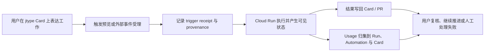

# 22 · jtype Card ↔ Agent Run 协作闭环 PRD

状态：Approved implementation contract，已完成 Kimi CLI / Grok CLI 两轮独立评审、交叉质询与最终一致性检查

Tracker：[GitHub Issue #14](https://github.com/cnjack/cloud/issues/14)

关联合同：

- `docs/design/plugin-platform.md`：Project Plugin、Service Kanban 与 Automation 合同
- `docs/15-project-workspace-architecture.md`：Project / Service 工作区信息架构
- `docs/16-repository-navigation-and-pr-automation.md`：Run 来源、幂等与 PR Automation
- `docs/17-jcode-device-relay.md`：Device Relay 与 E2EE 边界
- `docs/21-github-native-code-review.md`：GitHub 原生 Review 与 Bot 写回

## Executive summary

jcode Cloud 已经拥有两个互补的产品平面：

- **jtype Card 是持续工作的 Work Item 真相源**：目标、正文、负责人、讨论与业务状态留在 jtype；
- **Cloud Run 是一次执行的真相源**：调度、模型、执行日志、失败、产物与重试留在 orchestrator。

现有闭环已经能把 Card 移入 Service 的触发列、创建 `origin=kanban`
的 Run，并在终态把结果评论和可选完成列写回 Card。当前缺口不是“没有
Issue”，而是用户还不能在一个连续体验里可靠回答：

1. 这次 Card 变更会不会启动 jcode？
2. 会交给哪个 Service、模型和执行环境？
3. 谁请求、谁授权、谁承担责任，外部评论又以哪个 Bot 身份写回？
4. 自动化为什么接受、忽略、合并、阻塞或失败？
5. 这项工作实际消耗了多少，哪些费用只是未知或估算？

本 PRD 用四个可独立交付的 Feature Loop 补齐这些问题。交付顺序以事实源
优先：先建立 Kanban occurrence/receipt，再建立 provenance 投影，随后才是
Automation ledger 和 Usage。它不在 jcloud 内部复制 Issue/Comment 系统，
也不把 jtype Card assignee 伪装成 Cloud Agent 路由。

## Problem Statement

### 用户问题

项目成员把一张 jtype Card 拖入触发列时，操作看起来仍然只是普通看板
移动。Cloud 在后台轮询并创建 Run，但用户在动作发生前后缺少一个清晰的
执行承诺：目标 Service、模型、是否已经受理、被什么依赖阻塞，以及在哪
里继续观察。

Run 详情目前能显示 `api`、`kanban`、`schedule`、`webhook` 或
`automation` 来源，但来源不等于身份。系统已经有
`triggered_by_user_id`、Webhook 外部 actor、Automation owner、Plugin
runtime identity 和 provider Bot；这些信息没有收敛为一个用户可读、且不
参与越权授权的 provenance 合同。当前产品使用的 Service Plugin Kanban
路径每个 tick 都做 level scan；durable event cursor 只存在于 legacy
`kanban_links` 路径。因此产品路径无法保留精确 transition，也只能把
jtype event 中的 `editedBy` 当作无稳定 ID 的显示文本。

Automation 页面只显示最后一次 Run 和最后错误。用户无法查看一次规则为
什么匹配、是否被去重或 supersede、产生了哪个 Run、写回是否完成。Cron
只能直接创建 Run，缺少“需要团队继续协作时先创建 jtype Card”的明确输出
选择；SCM Review、Kanban 和 Cron 的输出边界也没有在同一产品语言中解释。

LLM 请求已经统一经过控制面 Proxy，但 Proxy 尚未采集 usage。用户无法按
Run、Service、Automation 或 jtype Card 查看 tokens，也无法区分 provider
报告的费用、Cloud 估算费用和完全未定价的 usage。任何看似精确但来源不明
的金额都会破坏信任。

### 业务后果

- 用户不确定拖卡是否等于真实执行，容易误触发或重复触发；
- Run 失败时需要在 Card、Automation 和 Run 三处猜测原因；
- Bot 写回容易被误认为是真实请求人或责任人；
- 自动化可用但不可运营，规则越多越难判断发生了什么；
- 使用量不可见，团队无法判断模型、Automation 和 Agent 工作的成本结构；
- 如果直接复制 Multica 的内部 Issue、Agent assignee 或聊天路由，会产生
  第二套 Work Item 真相和身份语义。

## Solution

### 产品承诺

> 从一张 Card 到一次 Agent Run，再到结果和用量回到原工作项，用户始终能
> 看懂“会不会跑、谁让它跑、在哪里跑、发生了什么、花了多少”。

### 权威对象映射

| 产品概念 | 权威对象 | 不承担的职责 |
| --- | --- | --- |
| 持续工作 | jtype Card | 不存 Cloud 调度状态机 |
| 执行策略 | Service Kanban / Automation | 不冒充 Card assignee |
| 一次执行 | Cloud Run | 不冒充 Card 的完成状态 |
| 执行日志 | Run Events | 不复制为 jtype 全量 transcript |
| 触发与关联 | Kanban claim / Automation occurrence / Webhook receipt | 不作为用户正文 |
| 业务回写 | Card comment/status、PR Review | 不改变 Run 历史 |
| 用量 | Run usage event 与聚合 | 不作为 provider 账单 |

### 用户闭环

### Feature Loop 1：Kanban 触发事实与执行回执

Service Kanban 继续采用“一个 board 最多绑定一个 Service”的当前合同。Card
进入触发列表示把工作交给该 Service 的 Cloud Agent 执行，不表示把 jtype
Card assignee 改成某个 Agent。

产品先保证“动作之后有诚实回执”，再增加依赖组件合同的阻塞式确认：

1. Service Kanban 顶部明确展示触发列、Service、repository、模型和结果写回
   位置；用户在拖卡前就能理解执行策略；
2. Cloud 为每张 Card 与 Service Kanban binding 建一个永久唯一的 claim，
   为每次有效进入触发列建立一个 occurrence；
3. 同一 durable event 或 Poller replay 返回已有 occurrence/Run，不重复创建；
4. 同一 Card 的 Run 已终态、writeback 已完成，并且 Card 先离开再重新进入
   触发列时，复用 claim、创建新的 occurrence 与 Run；
5. Card 仍在触发列时编辑正文、Poller 重扫、网络重试，或前一次 Run 仍活动
   时，不创建新的 occurrence；
6. accepted、blocked 和 failed 都形成可读 receipt。Cloud 内嵌面显示 receipt；
   外部 jtype 路径至少在 Card 上写入带稳定 occurrence marker 的评论；
7. Card 详情提供 Cloud executions 区域：最新状态、历史 occurrence/Run、
   责任人、用量摘要以及打开 Run 的深链；
8. 成功 Run 写评论并按现有配置移动完成列；失败或取消只写评论并留在原列；
9. 写回失败由 claim/occurrence 投影为 `writeback_pending`，重试成功前不显示
   “已完成回写”；
10. Card 删除后，Cloud 保留 claim、Run、provenance 和 usage 历史，并把外部
    对象显示为 deleted/unavailable，不伪造仍可打开的链接。

`jtype-board-react` 当前支持注入 `saveDocument`，但没有正式的
`beforeSave/cancelSave` 合同。首期不通过 Promise rejection 模拟“取消保存”，
避免把用户取消渲染为错误。阻塞式拖卡确认只有在 board package 提供明确的
pre-save/cancel hook 后才进入产品合同；此前由策略预览、触发列标记和即时
receipt 建立信任。服务器的模型、Plugin、权限、Board 和列校验始终是最终
判断。

### Feature Loop 2：Run Provenance 与 Bot 身份

在 Loop 1 的 claim、occurrence 和 receipt 事实源上，把现有的触发来源、用户、
外部 actor、Automation owner、Service、Plugin runtime identity 和写回身份
收敛为一个只读 provenance 投影。

用户首屏最多看到三个身份/来源槽位：

- **Requested / Accountable**：直接用户优先；自动化使用发布规则的成员；
  Kanban `editedBy` 只有显示文本、没有稳定 actor ID 时，显示 external actor，
  责任降级到规则 owner 并标明 `rule_owner`，不声称已映射 Cloud 用户；
- **Executed for**：Service、repository 与模型；
- **Triggered from**：Card、PR comment、SCM event、Cron 或 API 的稳定引用。

Cloud Runner/Device、完整 attribution precision 和技术 evidence 进入
inspector；GitHub App、Gitea/GitLab Bot 或 JType Plugin identity 只在
**Written back as** 区域显示。

授权与责任严格分离：

- `triggered_by_user_id` 继续表示直接的 Cloud 用户发起者，并可参与已有权限
  和 provider credential 选择；
- `accountable_user_id`、external actor 和 attribution source 只用于显示、
  审计与 usage 归集，任何授权代码不得读取它们；
- 自动化、Kanban bootstrap 和 service principal Run 可以没有人类
  originator；系统不得伪造一个 owner 作为授权人；
- Automation runtime principal 只沿用已冻结的规则、Project、Plugin 与
  credential revision 授权，不等同于 provider/JType 的展示用 Bot；
- Bot/App 是写回主体，不是请求人、责任人或 Agent persona。

### Feature Loop 3：Automation 运行历史与输出边界

Automation 详情增加统一的 execution ledger：

- trigger 来源和规范化事件；
- accepted、ignored、duplicate、superseded、blocked、queued、running 和终态；
- 创建的 Run、Card 或 PR Review；
- sanitized reason、下一步和发生时间；
- writeback 状态；
- Requested by / Accountable to / Written back as；
- usage 摘要。

输出模式按 Trigger/Run kind 明确限制，而不是暴露任意笛卡尔积：

| Automation 类型 | 允许输出 |
| --- | --- |
| Service Kanban | 使用已有 Card → Agent Run → Card 回写 |
| SCM Review | Review Run → provider 原生 PR Review |
| SCM Agent | 直接 Run；Agent 可按现有 Skill 主动执行 provider 操作 |
| Cron Agent | `run_only`；或在健康的 Service Kanban 中 `create_card` |

`create_card` 先创建带 occurrence 关联的 jtype Card，再由正常 Kanban
claim 路径创建 Run。Cron dispatcher 不同时创建直接 Run，避免双执行。
缺少健康 JType Plugin、Service Kanban、模型或目标列时，本次 occurrence
记录为 blocked 并给出修复动作，不回退为 `run_only`。

Manual Run Now 使用幂等键；重复点击返回同一个 occurrence/Run。
SCM provider webhook 继续由 Cloud 管理，不新增通用匿名 Webhook URL，不提供
raw payload 回放。

### Feature Loop 4：Usage 采集、归集与可信展示

控制面所有 Cloud Model Proxy 请求都经过同一个 `proxyResolvedModel` 路径。
首期在该共享路径上以透明 observer 方式采集 OpenAI-compatible JSON 和 SSE
响应中的 usage，而不是只覆盖 Run。observer 不得缓存完整响应、改变流式
时序或阻断上游成功响应。

首期记录：

- input tokens；
- output tokens；
- cache read/write tokens（provider 有报告时）；
- provider-reported cost（有报告时）；
- provider、model snapshot、subject kind 与 subject id；
- capture status：`reported | partial | unavailable | parse_error`。

subject 分为：

- `run`：关联 Run、Project、Service，并可经 occurrence/claim 关联
  Automation 与 jtype Card；
- `device`：仅限设备调用 **Cloud Model Proxy** 的路径，关联 Cloud user、
  device、model 与 grant scope，不伪造不存在的 Project/Service；
- 设备在本地直接调用模型、或经过 Device Relay 传输的 E2EE payload，不进入
  Cloud usage 统计。

金额规则：

- provider 报告的费用单独标记为 **Reported**；
- Cloud 只有 Cluster Admin 配置了不可变的 pricing revision 后才能显示
  **Estimated**。revision 包含 provider/model、input/output/cache 单价、币种
  和生效时间；usage event 必须引用或快照实际采用的 revision；
- 没有费用来源的 tokens 显示 **Uncosted**；
- 不把 Reported、Estimated 与 Uncosted 合成一个看似精确的金额；
- UI 明示“Usage is operational telemetry, not a provider invoice”。

Run-bound usage 的聚合维度：

- Run；
- Service；
- Project；
- Automation；
- jtype Card（通过 claim → Run）；
- model/provider；
- accountable member（仅精确或显式降级来源）。

Device Cloud Model Proxy usage 可按 user、device、model 和 grant scope
聚合，但不混入 Project/Automation 图表。Device Relay 的 prompt、response
和 envelope 继续是 E2EE opaque data，服务端不得解析设备命名空间密文。

原始 usage event 保留 90 天，UTC 小时聚合保留到所属 Project/User 删除后的
审计保留期结束；具体天数沿用集群数据保留策略。删除 Card、Model 或
Automation 不删除已有 usage/provenance snapshot。

## Personas

1. **Project Member**：创建工作、移动 Card、手动启动 Run、查看结果；
2. **Project Owner**：配置 Service、Plugin、Automation、责任归属和模型；
3. **Reviewer / Operator**：复核 PR、处理失败 Card、判断是否需要重试；
4. **Automation Author**：维护 Cron/SCM 规则并对无人值守执行负责；
5. **Cluster Admin**：配置模型、Provider、容量和安全边界；
6. **External Actor**：在 Git provider 或 jtype 中操作，但可能尚未映射到 Cloud 用户；
7. **Provider Bot / App**：代表 Project Plugin 写回，不是人类或 Agent。

## User Stories

### Card 与执行

1. 作为 Project Member，我希望在 Service Kanban 策略和触发列标记中看到 “Starts jcode”，从而在操作前理解它不是普通状态列。
2. 作为 Project Member，我希望在 Card execution preview 中看到 Service、repository、模型和写回目标，从而避免把任务交给错误的执行目标。
3. 作为 Project Member，我希望 Card 进入触发列后立即看到 accepted 或 blocked 回执、原因和修复人，从而不会把后台静默当成成功。
4. 作为键盘用户，我希望能通过可访问的状态选择把 Card 移入触发列，从而不依赖拖拽。
5. 作为外部 jtype 用户，我希望即使不经过 Cloud 内嵌确认，Card 仍获得受理或阻塞回执，从而不需要打开 Cloud 猜测。
6. 作为 Project Member，我希望重复保存或 Poller replay 不会产生第二个 Run，从而避免重复修改与费用。
7. 作为 Project Member，我希望点击 Card 能看到相关 Cloud executions，从而不必手工复制 Run ID。
8. 作为 Reviewer，我希望成功、失败和取消采用不同回写行为，从而失败不会被自动移动到 Done 而隐藏。
9. 作为 Reviewer，我希望回写失败显示 pending 并自动重试，从而不会把 Cloud 成功误认为协作闭环已经完成。
10. 作为 Project Owner，我希望禁用 Service Kanban 后停止新触发，但保留在途 Run 的冻结写回授权，从而不丢结果。
11. 作为 Project Member，我希望 Card 离开触发列、前次执行与回写都终止后再次进入时产生新的 execution，从而能明确请求再次执行。
12. 作为 Project Member，我希望只编辑仍在触发列中的 Card 不会再次执行，从而普通需求修订不产生意外费用。
13. 作为 Reviewer，我希望 Card 被删除后仍能查看 Cloud execution 历史，但链接明确显示 unavailable，从而审计记录不伪造外部对象。

### 身份、责任与 Bot

14. 作为 Project Member，我希望看到谁直接请求了 Run，从而知道应向谁确认上下文。
15. 作为 Project Owner，我希望自动化 Run 显示规则 owner，而不是伪造一个实时人类授权者。
16. 作为 External Actor，我希望系统保留我的外部显示身份，即使我没有 Cloud 账号映射。
17. 作为安全审计者，我希望 accountable identity 永远不参与授权，从而责任降级不会扩大权限。
18. 作为 Reviewer，我希望区分 Agent、Runner、Model 和 Provider Bot，从而不会把 GitHub App 评论误认为人类意见。
19. 作为 Project Member，我希望从 Card/PR 来源跳回原对象，从而可以在业务上下文中复核执行。
20. 作为 Project Owner，我希望看到 attribution 是 direct、linked external、rule owner 还是 unknown，从而知道归因精度。
21. 作为 Cluster Admin，我希望无法精确归因的执行仍然 fail-closed，不会因为 owner fallback 获得额外凭据。

### Automation

22. 作为 Automation Author，我希望查看每次 trigger 的处理结果，从而理解规则是否真正运行。
23. 作为 Automation Author，我希望区分 ignored、duplicate、superseded、blocked 和 failed，从而采取正确修复动作。
24. 作为 Automation Author，我希望 Manual Run Now 可安全重复点击，从而网络重试不会产生重复 Run。
25. 作为 Automation Author，我希望 Cron 可选择 run-only，从而后台任务不制造不必要的 Card。
26. 作为 Automation Author，我希望需要协作的 Cron 可选择 create-card，从而结果进入团队正常看板流程。
27. 作为 Project Member，我希望 create-card 模式在 JType 不可用时明确阻塞，而不是静默改成 run-only。
28. 作为 Reviewer，我希望 SCM Review 始终写回 provider-native Review，从而不会再去 jtype 找同一结果。
29. 作为 Project Owner，我希望 Automation 页面只暴露真实支持的 output，从而不会配置无法执行的组合。
30. 作为 Automation Author，我希望从 ledger 直接打开产生的 Run、Card 或 PR，从而快速定位结果。
31. 作为 Project Owner，我希望规则删除或 Plugin 重连不破坏在途执行的冻结 provenance 和 writeback，从而历史仍可审计。

### Usage

32. 作为 Project Member，我希望在 Run 上看到 tokens 和 capture status，从而知道这条数据是否完整。
33. 作为 Project Owner，我希望按 Service 和 Automation 比较 usage，从而发现高成本规则。
34. 作为 Project Member，我希望在 Card 上看到所有相关 Run 的 usage 汇总，从而理解一项工作的完整消耗。
35. 作为财务或平台负责人，我希望 Reported、Estimated 和 Uncosted 分开，从而不会把估算当账单。
36. 作为 Cluster Admin，我希望 usage parser 失败不影响 LLM 流，从而观测能力不会破坏执行。
37. 作为 Project Owner，我希望删除模型后历史 Run 仍保留 model snapshot，从而 usage 不失去上下文。
38. 作为安全审计者，我希望 usage 存储不包含 prompt、response、API key 或原始 provider body，从而降低敏感数据暴露。
39. 作为 Device Cloud Model Proxy 用户，我希望看到按设备和模型归集的 usage，从而理解远程设备的控制面调用。
40. 作为 Device Relay 用户，我希望 Cloud 不为统计而解密本地模型或 Relay 内容，从而 E2EE 合同保持不变。

### 可访问性与恢复

41. 作为键盘用户，我希望 Card 状态选择、execution panel 和 Automation ledger 能完整键盘操作，从而不依赖拖拽或鼠标。
42. 作为窄屏用户，我希望身份和 usage 信息按优先级折叠，而不是横向溢出。
43. 作为任何用户，我希望网络或 Provider 失败保留最后已知数据并给出 Retry，从而不会看到空白或伪成功。
44. 作为 Viewer，我希望可以查看 provenance、history 和 usage，但不能触发、重试或修改策略。

## Product Requirements

### R1 · 一项工作只有一个 Work Item 真相

- jcloud 不新增 Issue、Comment 或 Card 正文表；
- Card 正文、assignee、讨论和业务状态留在 jtype；
- Run status 不自动等同于 Card status；
- 成功移动完成列是明确配置的 writeback policy，不是 Run completion 的隐式副作用。

### R2 · 一次执行只有一个 Run 真相

- 调度、模型、events、failure、artifact、retry、session 和 usage 留在 Cloud；
- jtype 只收到摘要、状态移动和 Cloud 深链；
- Card execution panel 读取 Cloud claim/Run 投影，不把 Run 状态复制进 Card frontmatter。

### R3 · 触发可预期、重复可收敛

- Service Kanban 策略、触发列标记和 Card preview 在动作前说明执行目标；
- 内嵌与外部客户端都以服务器 receipt 为事实，不依赖 UI 确认才能受理；
- claim、occurrence 和 receipt 分层负责 DB 级幂等；
- 同一卡片离开触发列、前次执行与回写终止后再次进入才创建新 occurrence；
- 仍在触发列中的编辑、重扫、同事件 replay 和活动执行不创建新 occurrence；
- blocked 必须说明依赖和修复角色；
- 不允许 unavailable dependency 静默降级到另一种 output mode。

### R4 · 身份可解释、授权不混淆

- provenance 输出采用 actor ref，而不是只有字符串；
- direct user、external actor、automation/rule owner、service principal 和 Bot identity 可区分；
- attribution source 是稳定枚举；
- authorization 只读已有 principal/triggered-by 契约；
- accountable、external actor 和 Bot identity 绝不用于授权。

### R5 · 自动化可运营

- 每次自动 trigger 都有 occurrence/receipt；
- 每个 receipt 都能解释是否产生 Run/Work Item；
- Manual Run Now 支持 idempotency key；
- History 默认 newest-first，并支持状态过滤；
- raw provider payload、headers、signature 和 token 不进入 history；
- SCM Review、Kanban、SCM Agent 与 Cron 的 output 集合固定且文档化。

### R6 · Usage 诚实

- Proxy observer 只提取 usage 字段，不记录正文；
- parser 失败不改变上游响应；
- capture status 与 cost source 是一等字段；
- unknown/uncosted 是可见状态；
- 所有聚合可追溯回 Run usage；
- Cloud Model Proxy 的 `run` 与 `device` subject 保持独立归集；
- Estimated 必须引用不可变 pricing revision；
- UI 不使用“账单”“应付金额”等文案。

## UX Contract

### 信息优先级

Run/Card/Automation 表面统一使用：

1. 当前结果或阻塞；
2. Requested by / Accountable to；
3. 来源深链。

执行目标、writeback、Usage、Runner/Bot、技术 ID、event key、credential
revision 和 parser detail 进入展开区或 inspector，不与核心状态争夺首屏。

### 文案

- 用 “Starts jcode” 描述触发列，不用“AI magic”“Autopilot is thinking”；
- 用 “Requested by”“Accountable to”“Written back as”区分身份；
- 用 “Blocked” 表示依赖未满足，用 “Failed” 表示已开始后失败；
- 用 “Reported”“Estimated”“Uncosted”描述费用来源；
- 不使用完成 Toast 代替持久状态。

### 空态与错误态

- 没有历史：解释触发后会出现什么；
- Plugin missing/action-required：禁用动作并提供打开 Plugin 的入口；
- Model missing：指出 Service Owner 或 Cluster Admin 的具体修复责任；
- Board drift：保留最后已知 board identity，停止新触发，允许修复；
- Writeback pending：显示 Run 已结束但 Card 尚未同步；
- Card deleted：保留 execution/provenance/usage，外部链接显示 unavailable；
- Usage unavailable：显示原因类别，不显示 `$0.00`。

## Implementation Decisions

### Deep module 1：Kanban transition、occurrence 与 receipt

把“Card 是否从非触发状态进入触发状态、绑定是否健康、模型是否可解析、是否
已有 claim/active occurrence”收敛为一个服务。事件消费者、bootstrap scan、
Card preview 和测试共享它。

claim 是 `(automation_id, document_id)` 的永久关联锚点，不再承担“一生只跑
一次”的语义。occurrence 表示一次有效进入触发列，使用稳定 transition event
key 幂等。首次进入创建 claim + occurrence；离开再进入复用 claim 并创建新
occurrence。active occurrence、同事件 replay、仍在列内的正文编辑不创建新
occurrence。

Plugin Service Kanban 从 level scan 迁移到 durable board event cursor，以
保留 `editedBy` 和精确 transition。保留一次性 level scan 只用于升级或新
binding 的 bootstrap；bootstrap 归因必须标为 rule-owner/unattributed，
不能猜测最后编辑者。

每个 occurrence 在尝试创建 Run 前先持久化 receipt，并以带 occurrence marker
的幂等 Card comment 投影 accepted/blocked/failed。comment 写入重试不得产生
重复可见回执。Card 删除把 external ref 标记为 unavailable，不删除事实。

`jtype-board-react` 在正式提供 pre-save/cancel hook 后，可以在不破坏
`baseContentHash`/`baseContent` 乐观并发的前提下增加阻塞式确认；该能力不是
前四个 Loop 的依赖。

### Deep module 2：Run provenance resolver

新增一个独立 resolver，从 Run、Automation、Webhook receipt、Kanban
claim/occurrence/event、Project member 和 Plugin snapshot 生成稳定的
`RunProvenance` 投影。HTTP handler、Card execution panel、Automation ledger
和 usage aggregator 都消费同一投影，不各自复制归因瀑布。

投影至少包含：

- trigger kind、label 和 external reference；
- requested actor；
- accountable actor；
- attribution source；
- Service/Project；
- executor kind 和 model snapshot；
- writeback actor；
- precision：`exact | linked_external | rule_owner | unattributed`。

jtype `editedBy` 当前只有显示文本、没有稳定 actor id。它只能生成
`linked_external`/`unattributed` 显示快照；accountable 降级到冻结的 rule
owner。除非未来 JType 合同提供稳定 actor ref，否则不得把同名文本映射成
Cloud 用户。

### Deep module 3：Automation execution ledger

用一个统一查询模型组合 Automation、occurrence/receipt、Run、output ref 和
writeback status。SCM receipt、Cron occurrence 与 Kanban claim 可以保留
各自存储，但 API 投影必须一致。

Manual trigger 接受 caller 生成的 idempotency key；`(automation_id, key)`
至少保留 24 小时并返回相同 occurrence/Run，occurrence 本身永久保留。
Cron occurrence key 是 `(automation_id, scheduled_fire_at)`。

Cron `create_card` 用 occurrence id 派生确定性 Card path，通过现有 JType
`SaveDocument` 创建 Card；进程若在远端创建成功、绑定落库前崩溃，恢复流程
先按 path 解析同一 Card，不能再创建第二张。occurrence 绑定 Card document
id 后，再由正常 Kanban claim/occurrence 路径创建 Run；Cron dispatcher 不
直接创建第二个 Run。恢复时若该 path 对应的 Card 已删除或不可访问，本次
occurrence 标记为 blocked，不能用同一路径重建一个看似相同的新 Work Item。

### Deep module 4：Usage observer

共享 `proxyResolvedModel` 上的 observer 支持非流式 JSON 与 SSE 的最终 usage
chunk。它使用有界 parser 状态，不保留完整响应；记录失败时只存错误类别。
每个上游请求产生稳定 request id，重复完成回调不会重复累计。observer 按调用
上下文写入且只写入一个 primary subject：`run` 或 `device`。一个请求即使
经过设备代理也不能同时计入两类；有 Run context 时以 `run` 为主，避免 tokens
与费用双计。本地模型与 Device Relay envelope 不进入该路径。

Usage 原始事件 append-only；修正通过显式 replacement/version 处理，不对旧
数值做无来源累加。Estimated cost 关联不可变 pricing revision。聚合使用 UTC
小时桶，查看者时区只在查询时切分日期；raw event 保留 90 天，rollup 按集群
数据保留策略清理。

### API contract

首期增加或扩展：

- Run response 的 `provenance` 与 `usage_summary`；
- Card executions 查询：按 Service Kanban binding + document id 返回 claims、
  occurrences、receipts、Runs、writeback 和 usage；
- Kanban policy/preview：返回触发列、执行目标、写回目标和当前依赖健康状态；
- Kanban occurrence/receipt：返回 accepted/blocked/failed、原因、修复角色和
  external writeback 状态；
- Automation execution history 与单条 execution detail；
- Manual Automation run 的 idempotency key；
- Run/Project/Service/Automation/Card usage summary；
- Device Cloud Model Proxy 的 user/device/model usage summary。

所有列表分页且有固定排序。错误继续使用现有 typed error envelope。API 不返回
Plugin token、provider secret、raw webhook body、LLM body 或 device envelope
明文。

### Schema contract

迁移保持 append-only、idempotent。需要的逻辑实体：

- Run accountability/provenance source；
- Kanban claim anchor、transition occurrence/receipt、event cursor 与 actor
  snapshot；
- Automation occurrence/receipt 到 output 的稳定关联；
- model pricing revision；
- `run | device` subject usage event；
- UTC hourly usage rollup。

外部 actor 使用 provider + stable external id；display name 是快照。删除 Cloud
用户不删除历史 provenance。现有 `triggered_by_user_id` 保持授权语义，不通过
重命名迁移改变含义。

### Authorization

- Viewer：只读 provenance、history、usage；
- Member：触发 Card、Manual Automation、重试允许的 Run；
- Owner：配置 Service Kanban、Automation output 和责任策略；
- Cluster Admin：配置 Provider/Model，不自动获得 Project 工作修改权限；
- 外部 actor 映射只影响显示和 direct attribution，不自动授予 Project 成员身份。

## Acceptance Criteria

### AC1 · Kanban

1. Service Kanban 策略和触发列标记在动作前显示 Service、repository、model、
   output 和当前 blocker；
2. 内嵌或外部 jtype 把 Card 移入触发列后，都产生一个持久 occurrence 和一条
   accepted 或 blocked receipt；
3. 外部路径在 Card 上收到带稳定 occurrence marker 的可操作评论，不需要
   打开 Cloud 才能判断是否受理；
4. 同一 event replay、level bootstrap 重扫或仍在触发列的正文编辑不创建
   重复 occurrence/Run/评论；
5. 前次 Run 已终态、writeback 已完成且 Card 离开后再次进入时，复用 claim
   并创建新的 occurrence/Run；
6. active Run 期间离开又进入不并发创建新 Run，并给出已有执行回执；
7. blocked Card 在依赖修复后由同一 occurrence 继续，不创建第二次受理记录；
8. 成功写评论并可选移动完成列；失败/取消写评论但不移动；
9. writeback 失败保持 pending 并重试，重试不产生重复评论；
10. 禁用 binding 不影响已有 Run 的冻结 writeback；
11. Card execution panel 能打开每个关联 Run，并在 Card 删除后把来源显示为
    unavailable；
12. 键盘用户不通过拖拽也能完成状态移动和查看 receipt。

### AC2 · Provenance

1. Manual member Run 显示同一成员为 Requested by 与 Accountable to；
2. Cron Run 不伪造 Requested by，显示 rule owner 为 Accountable to；
3. 已映射 SCM actor 显示 Cloud 成员和 provider identity；
4. 未映射 actor 显示 external actor，不显示任意 Project owner 为请求人；
5. 只有显示文本的 jtype `editedBy` 不按姓名猜测 Cloud 用户；
6. Bot/App 只显示在 Written back as；
7. accountable 字段变化不能改变任何 authorization 测试结果。

### AC3 · Automation

1. SCM、Cron 和 Kanban execution history 使用同一状态词汇；
2. 每条 history 能链接到 Run/Card/PR；
3. duplicate/superseded/ignored 不伪装成 succeeded；
4. Manual double-submit 返回同一 execution；
5. Manual idempotency key 在 24 小时窗口内返回同一 execution；
6. Cron create-card 一次 occurrence 只创建一张 Card 和一个首次 Run；
7. 进程在 `SaveDocument` 成功、Card binding 落库前崩溃，恢复后仍解析同一
   deterministic Card path；
8. JType 不可用时 create-card blocked，不创建 direct Run；
9. SCM Review output 不能改成 jtype Card；
10. Service Kanban history 只在 Service Kanban/Card executions 展示，不进入
    面向用户的通用 Automation 列表；
11. history 不暴露 raw webhook 或凭据。

### AC4 · Usage

1. 非流式和 SSE usage 都能归到正确 `run` 或 `device` subject；
2. parse failure 不改变客户端收到的 status/body/stream；
3. 重复 callback 不重复累计；
4. Reported、Estimated、Uncosted 分开展示；
5. Estimated 关联不可变 pricing revision；缺少 revision 时显示 Uncosted；
6. 没有 usage 时显示 unavailable，不显示零；
7. Card 汇总等于关联 Run usage 之和；
8. Project/Service/Automation 聚合能追溯到 Run；
9. Device Cloud Model Proxy usage 只进入 user/device/model/grant 聚合；
10. usage 表不含 prompt、response、API key 或原始 provider payload；
11. raw event 90 天清理与 rollup 保留策略有可验证作业；
12. 本地模型和 Device Relay E2EE 零明文检查继续通过。

## Testing Decisions

### 测试原则

- 只测试可观察合同，不断言私有函数调用顺序；
- Memory Store 与 PostgreSQL Store 使用同一组 contract cases；
- 并发、幂等和 first-writer-wins 必须有 PG 测试，不能只靠内存测试；
- UI 测试覆盖键盘、loading、empty、blocked、error、retry 和窄屏信息优先级；
- Provider/JType 使用仓库内 fixture server，不读取 workspace 外部 fixture；
- 流式 usage 测试验证 chunk 时序与字节保持，不只验证最终累计。

### 模块测试

1. Kanban transition：首次进入、离开再进入、列内编辑、replay、bootstrap、
   active occurrence、board drift 和 model gate；
2. Kanban receipt/writeback：external comment marker、retry、Card deletion 和
   binding disabled；
3. Provenance resolver：所有来源、映射、降级与 authorization 隔离；
4. Automation ledger：状态投影、分页、filter、output link；
5. Manual idempotency、Cron occurrence 并发与 create-card crash recovery；
6. Usage observer：JSON、SSE、partial、invalid、duplicate、large stream、
   run/device subject；
7. Usage rollup：时区、model deletion、pricing revision、retention、
   uncosted、Card/Automation/device 聚合；
8. Kanban/Provenance/Usage UI：权限、键盘路径和窄屏可访问性。

### 端到端测试

每个 Feature Loop 至少增加一条可独立运行的旅程：

- jtype Card 从非触发列进入触发列 → receipt → Run → comment/move；
- 同一卡片列内编辑不重跑，离开并再次进入产生第二个 occurrence；
- Cron create-card → Card → Run → writeback；
- SCM/Manual/Cron/Kanban 四种 provenance 展示；
- 两次 LLM 调用 → Run/Card/Automation usage 对账；
- 依赖缺失的 fail-visible 负路径。

### 交付验证

- Orchestrator：`go test ./...`；
- Console：`pnpm test && pnpm typecheck`；
- 受影响 Kustomize target 全部 render；
- 涉及 Device 表或 envelope 时运行 PG-gated store suite 与 E2EE
  zero-plaintext journey；
- 每个 Feature Loop 在提交前由 Kimi CLI 与 Grok CLI 按本 PRD逐条对抗评审，
  确认缺陷修正后再运行最终测试。

## Delivery Loops and Commit Boundaries

### Loop 0 · PRD

1. 仓库现状与边界审计；
2. PRD draft；
3. Kimi CLI / Grok CLI 独立评审；
4. 汇总争议并修改 PRD；
5. 发布到项目 tracker，标记 `ready-for-agent`；
6. 提交：`docs(product): define card-to-run collaboration contract`。

### Loop 1 · Kanban 触发事实与执行回执

1. 设计 embedded 与 external jtype 两条 journey；
2. 页面级 UI prototype：Kanban policy/receipt/Card executions；
3. 先写 claim/occurrence、transition cursor、receipt/writeback tests；
4. 实现 durable event cursor、bootstrap、occurrence、Card receipt 和 Card
   executions panel；
5. Kimi/Grok 对照 AC1 对抗评审；
6. 真实 jtype fixture + Console tests；
7. 独立 conventional commit。

### Loop 2 · Provenance 与 Bot 身份

1. 设计 provenance state/source 与 authorization invariants；
2. 页面级 UI prototype：Run provenance 与 Bot inspector；
3. 先写 Store/API/UI contract tests；
4. 实现 resolver、schema、API 与 UI；
5. Kimi/Grok 对照 AC2 + diff 对抗评审；
6. 修正并全量测试；
7. 提交：一个完整 vertical slice，不把无 UI 的半套 schema 单独交付。

### Loop 3 · Automation ledger 与输出

1. 设计 trigger × output 合法矩阵和 occurrence state；
2. 页面级 UI prototype：Automation history/detail；
3. 先写 ledger、manual idempotency、Cron create-card tests；
4. 实现 schema/API/UI/dispatcher；
5. Kimi/Grok 对照 AC3 对抗评审；
6. SCM/Cron/Kanban 正负路径测试；
7. 独立 conventional commit。

### Loop 4 · Usage

1. 设计 provider usage/cost source 与 privacy contract；
2. 页面级 UI prototype：Run/Project/Card usage；
3. 先写 transparent stream observer 与 rollup tests；
4. 实现 capture、storage、aggregation 与 UI；
5. Kimi/Grok 对照 AC4 对抗评审；
6. 流式、PG、Console 与 E2EE 回归；
7. 独立 conventional commit。

每个 Loop 都必须完成自己的设计、UI、实现、评审和测试，不能把评审或测试
统一推迟到最后。跨 Loop 的重构只有在当前 Loop 有直接产品收益时才进入该
提交。

## Out of Scope

- 在 jcloud 内新增 Issue、Comment、Inbox 或第二套 Kanban；
- 在 `jtype-board-react` 提供正式 pre-save/cancel hook 前，用 rejected Promise
  模拟阻塞式拖卡确认；
- 把 legacy `kanban_links` 重新暴露为新的产品配置面；迁移期只做兼容读取；
- 把 jtype Card assignee 当成动态 Cloud Agent selector；
- Squad、多 Agent 自动互相提及或无限协作循环；
- 任意 jtype 评论触发 Agent。当前 JType Plugin path 没有可直接消费的
  durable comment-trigger + Cloud identity contract；需要先修改 jtype 合同；
- Slack、飞书等通用 Agent Bot；
- 通用匿名 Webhook builder、raw payload 存储或 webhook replay；
- 自动 merge PR、自动批准权限或绕过现有 provider consent；
- provider invoice、结算、充值或财务级 billing；
- budget、hard cap 或自动停机策略；
- 为了 Usage 解密 Device Relay envelope；
- 统计设备本地模型或未经过 Cloud Model Proxy 的 usage；
- 在首期提供跨 Provider 一致的 session resume 承诺；
- 恢复未经正确实现和验证的 `skip|queue|replace` 通用并发策略。

## Further Notes

### 与 Multica 的取舍

直接借鉴：

- Work Item 与一次执行分离；
- 触发前说明会启动谁；
- Run provenance 中授权、责任和 Bot 分离；
- 自动化 occurrence/receipt 与可见失败；
- usage 中 uncosted/unknown 是一等状态。

不照搬：

- 内部 Issue-first 壳；
- 全表 polymorphic actor；
- 一个 Bot 绑定一个 Agent；
- Agent 互相提及和 delayed fallback；
- 客户端静态价格作为费用真相；
- task completed 暗示 work item done。

### 成功指标

首期不以“创建了多少 Automation”作为成功。关注：

- 触发后无法解释来源的 Run 比例；
- Kanban duplicate Run 比例；
- blocked trigger 到修复的完成率；
- terminal Run 的 writeback pending 时长；
- Automation execution 有明确 outcome 的覆盖率；
- usage capture 的 reported/partial/unavailable 分布；
- 用户从 Card 打开 Run 和从 Run 返回 Card 的成功率。

### 发布前最后审计

批准本 PRD 前，评审必须逐项确认：

1. 所有设计均以 jtype Card 为 Work Item 真相，而非复制 Issue；
2. 所有身份展示均不扩大授权；
3. external jtype、Cloud embed、SCM、Cron 与 Manual 均有闭环；
4. 依赖不可用不会伪成功或静默改模式；
5. usage 不冒充 provider invoice；
6. Device E2EE 边界未改变；
7. 每个 Feature Loop 都有独立 UI、tests、CLI 对抗评审和提交证据。

### Review decision record

- 第一轮 Kimi/Grok 独立指出：不能把现有 Plugin level scan 描述成 event
  cursor、Kanban 回执必须先于身份 UI、board package 不支持可取消保存、
  Usage 必须与 E2EE Relay 分界；
- 第二轮用仓库证据纠正并收敛：JType `SaveDocument` 可支持 `create_card`，
  claim 与可重复 occurrence 必须分离，`editedBy` 不足以建立 Cloud 身份；
- 最终一致性检查未发现未解决的 P0/P1。非阻断建议已进入合同：Automation
  runtime principal 与 Bot 分离、Usage primary subject 防双计、已删除
  deterministic Card 不自动重建。
