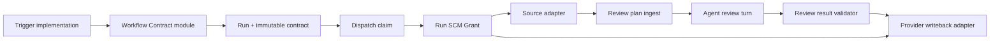
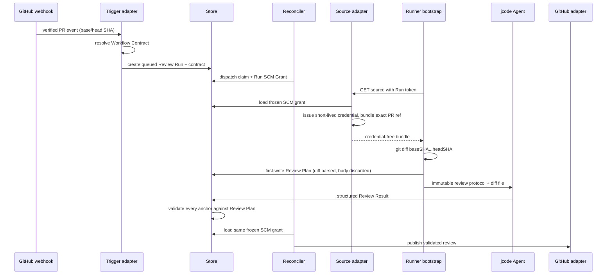

# 29 · Workflow Contract 与 Deterministic Review 详细设计

状态：Ready for Ship-R1 implementation
产品合同：`docs/28-workflow-contract-and-deterministic-review-prd.md`
对标依据：`docs/30-open-source-agent-workflow-benchmark.md`
首个实现范围：Ship-R1 tracer bullet

## 1. 设计目标

Ship-R1 必须在不引入通用 Workflow Builder 的前提下证明三件事：

1. 任意新 Run 都有一份可展示、可哈希、不可变的 Workflow Contract；
2. Plugin-bound 私有 GitHub Review Run 从 source 到 review writeback 使用同一份
   frozen SCM grant；
3. Review 固定到 commit pair，所有 inline finding 通过 server-owned changed-line
   index 校验，并在 Run detail 展示 coverage。

Ship-R1 不创建 Custom Agent Profile CRUD。它先提供两个 versioned built-in profiles：
Developer 与 Reviewer。PM、Architect、Custom profile 以及 Runner readiness picker
按同一 API/视觉合同在 R2 进入，不在 R1 伪造不可用动作。

对标调研进一步固定三个边界：OpenHands 式 Agent Profile、LLM Profile 与 Runner
Backend 是不同概念；Ship-R1 不新建 LLM Profile 或 Runner Profile CRUD，只冻结
当前 model selection 与实际 effective timeout。`gh-aw` 式可编辑 Workflow
Definition 与每次运行的 compiled contract 是不同对象；任何 provider write 都是
typed delivery，不由 Agent 持有宽写权限直接执行。Ship-R1 先实现 compiled
contract，Ship-R2 再开放 definition authoring、LLM/Runner profile 管理与 live
readiness。

## 2. Architecture



For an implementation Run, the only Ship-R1 delivery variant is:

```json
{
  "delivery": {
    "outputs": [{
      "type": "create_pull_request",
      "target": "service_repository",
      "ready_policy": "lifecycle_aware"
    }],
    "merge": "never"
  }
}
```

`ready_policy` is required for `create_pull_request` and forbidden for
`provider_review`. A readonly Service uses `{"type":"diff_only"}` and carries
neither provider target nor lifecycle fields.

### 2.1 Module responsibilities

| Module | Owns | Does not own |
| --- | --- | --- |
| Workflow Contract | canonical snapshot、built-in profile revision、hash、Runner instruction envelope | authorization、credential、mutable profile lookup |
| Run SCM Grant | provider/config/credential/repository immutable references、credential issuance adapter | prompt、review rules、provider UI |
| Review Plan | commit pair、unified-diff parser、changed-line index、coverage summary | model execution、provider comment formatting |
| Review Result | structural limits + changed-line anchor validation | git diff creation、credential |
| Run inspector | present frozen contract/grant/coverage | derive current policy as historical truth |

## 3. Data design

Migration `0064_workflow_contract.sql` is additive and idempotent. It alters both
`runs` and `run_plugin_snapshots`; repository identity is not left in a separate
future migration.

### 3.1 Run columns

| Column | Type | Default | Meaning |
| --- | --- | --- | --- |
| `execution_contract` | JSONB | `{}` | canonical immutable contract; legacy rows remain empty |
| `pr_head_sha` | TEXT | `''` | exact reviewed/patched head commit |
| `pr_base_sha` | TEXT | `''` | exact base tip from the verified event/provider |
| `review_plan` | JSONB | NULL | first-writer-wins changed-line index + coverage metadata |

`execution_contract` is written in the same transaction as the Run. `review_plan`
is written once by the Runner pre-agent bootstrap after the exact source bundle is
materialized. A later agent process holding the same Run token cannot overwrite it.

### 3.2 Workflow Contract schema v1

```json
{
  "schema_version": 1,
  "hash": "sha256:…",
  "workflow": {
    "id": "builtin:pull-request-review",
    "name": "Pull Request Review",
    "revision": 1,
    "source": "builtin",
    "definition_hash": "sha256:…"
  },
  "profile": {
    "id": "builtin:reviewer",
    "name": "Reviewer",
    "role": "reviewer",
    "revision": 1,
    "instructions": "Review the exact change…"
  },
  "trigger": {
    "kind": "scm",
    "origin": "automation",
    "receipt_id": "delivery-id",
    "actor": "github:user:123",
    "repository": "cnjack/cloud",
    "object": "pull_request:24",
    "action": "synchronize"
  },
  "execution": {
    "run_kind": "review",
    "llm_selection": {
      "model_id": "…",
      "model_name": "…",
      "effort": "high",
      "source": "run_request"
    },
    "session": false,
    "permission_mode": "full_access",
    "workspace_access": "read_only",
    "provider_credentials": "none",
    "base_ref": "main",
    "timeout_seconds": 43200,
    "timeout_source": "cluster_default"
  },
  "delivery": {
    "outputs": [{"type": "provider_review", "target": "trigger_pr"}],
    "merge": "never"
  },
  "verification": {
    "mode": "structured_review",
    "rules_revision": "review-v2",
    "max_findings": 8,
    "minimum_confidence": 80
  },
  "requirements": ["source.read", "git", "ripgrep", "scm.review.write"],
  "resolved_at": "2026-08-01T00:00:00Z"
}
```

The hash is computed over the same object with `hash` and `resolved_at` omitted.
Go struct field order is the canonical order; unknown fields are rejected when a
contract is decoded from storage. Excluding `resolved_at` lets preview and create
compare the same resolved configuration. Run ID is the instance identity;
`workflow.definition_hash` and contract `hash` compare definition/configuration,
not occurrence identity.

`workflow.definition_hash` is stable across Runs that use the same Workflow
revision. Ship-R1 built-in definitions are code-owned constants. Ship-R2
definitions are published artifacts compiled from UI or
`.jcode/workflows/*.md`. The Runner receives the contract envelope, not a mutable
file lookup. Ship-R1 freezes the same Project/Cluster effective timeout already
used for Kubernetes `activeDeadlineSeconds`; it does not pretend to validate a
future Runner Profile.

Ship-R1 built-ins are explicit:

| Definition | Profile | Used for | Revision rule |
| --- | --- | --- | --- |
| `builtin:implementation-task@1` | `builtin:developer@1` | any non-Review Manual/JType/SCM/Cron/API Run without a published custom workflow | any semantic prompt/requirements/output change requires a revision bump |
| `builtin:pull-request-review@1` | `builtin:reviewer@1` | automatic/manual Pull Request Review | any protocol/rules/requirements/output change requires a revision bump |

`definition_hash` is SHA-256 over the canonical built-in definition with name,
revision, profile reference, requirements, output types and platform-owned prompt
body. A changed hash without a revision bump fails a unit test.

`llm_selection` is a frozen projection, not an LLM Profile revision.
`timeout_source` and `workspace_access` are resolved execution facts, not a
Runner Profile. Ship-R1 contract/API contains no `llm_profile_revision` or
`runner_profile_revision`; those fields may be added only when the corresponding
resources exist in Ship-R2.

Ship-R1 `requirements` are a closed binary enum used for audit/instruction
derivation; they are not a claim that tool versions were preflighted. Ship-R2
replaces toolchain entries with typed constraints such as
`{"capability":"node","minimum_version":"22"}` and compares them with the
operator-owned Runner manifest.

The exhaustive Ship-R1 enum is `source.read`, `source.write`, `git`, `shell`,
`ripgrep`, `scm.pull_request.write`, and `scm.review.write`. The Developer
built-in requires `source.read`, `source.write`, `git`, `shell`, and `ripgrep`,
plus `scm.pull_request.write` only when delivery is `create_pull_request`. The
Reviewer built-in requires `source.read`, `git`, `ripgrep`, and
`scm.review.write`. No unrecognized string is accepted.

### 3.2.1 Trigger facts by kind

`trigger.kind` is a discriminant, not a three-field generic bag:

| Kind | Required frozen facts |
| --- | --- |
| `manual` | accountable actor, Service, request ID |
| `jtype` | receipt/occurrence ID, Card ref, external actor, Automation owner |
| `scm` | verified receipt/delivery ID, provider actor, repository, object, action, ref/PR number |
| `cron` | occurrence ID, rule owner, scheduled timestamp, `[window_start, window_end)`, output mode |
| `api` | scoped service principal and idempotency key |

Each adapter has different dedupe/concurrency semantics. They share resolver and
canonicalization code, not delivery defaults. A newer synchronized PR event uses
the new head SHA and may cancel an older queued/running Review for the same PR;
delivery replay of the same receipt is idempotent.

| Kind | Idempotency key | Concurrency group | Cancellation/coalescing |
| --- | --- | --- | --- |
| `manual` | Service + request ID | none by default | never auto-cancel |
| `jtype` | Automation + occurrence/receipt ID | workflow + Card ID | Card leaving active states cancels queued/running work; terminal state prevents retry |
| `scm` | Automation + verified delivery ID + action | workflow + repository + PR/object ID | newer PR head cancels older Review; replay of one delivery is ignored |
| `cron` | Automation + UTC window start | Automation ID | one occurrence per window; overlapping tick is coalesced, not duplicated |
| `api` | scoped principal + Service + idempotency key | none unless Workflow defines one | no implicit cancellation |

Cron `scheduled timestamp` and window boundaries are UTC RFC3339 instants with
second precision. The occurrence identity is derived from Automation ID plus the
exact `scheduled_for` instant; timezone conversion happens only when calculating
the schedule, never during dedupe.

### 3.3 Run SCM Grant schema

Ship-R1 deepens the existing `run_plugin_snapshots` aggregate instead of introducing
a second credential table. For the Service's SCM installation, the dispatch
transaction additionally freezes:

| Field | Purpose |
| --- | --- |
| `repository_id` | provider-stable repository identity |
| `repository_path` | frozen owner/name used by provider operations |
| `clone_url` | frozen provider clone route; never includes credential |
| `default_branch` | frozen Service repository baseline |
| `acting_principal_kind` | installation/bot/app kind used for provider writes |
| `acting_principal_id` | provider-stable non-secret principal identifier |

Provider/config/credential revisions already exist in the row. Together these
fields are exposed inside the control plane as `RunSCMGrant`. Public APIs return
only non-secret audit facts and revision identifiers.

The dispatch transaction locks provider config, installation and repository
binding in stable order. A mismatch returns `dispatch_claim_unavailable`; it
does not build a partial snapshot. New Plugin-bound runs may not call the current
Service credential resolver after this point.

Base/head revision pair remains on `runs` because it describes Review input, not
authorization. Create/preview checks are named `scm_install_ready`;
`run_scm_grant` does not exist until dispatch claim. If claim detects
reconnect/rename/config drift, the queued Run fails with
`dispatch_claim_unavailable`, stores no partial grant, and requires a new Run
resolved from current state.

Grant-consumer matrix is part of Ship-R1 acceptance:

| Operation | Frozen inputs | Forbidden after claim |
| --- | --- | --- |
| source bundle / short-lived clone credential | provider/config/credential revision、repository identity/clone route | `ResolveForService`、current Service repository/binding |
| source bundle push | same grant + delivered bundle identity | current Service credential/repository |
| PR create/update/readiness | same grant + typed `create_pull_request` output | current `RepoOwnerName`、current ready policy |
| Review PR read/commit check | same grant + Run revision pair | live repository binding or branch-only fallback |
| Review publish/summary fallback | same grant + validated result + plan hash | current Service credential/repository |

Tests instrument every provider adapter call and assert the same installation,
provider/config/credential revision and repository identity across the row. A
new Plugin-bound Run has no compatibility resolver fallback.

### 3.4 Review Plan schema v1

```json
{
  "schema_version": 1,
  "plan_hash": "sha256:…",
  "rules_revision": "review-v2",
  "base_ref": "main",
  "head_ref": "feature/x",
  "base_sha": "40hex",
  "head_sha": "40hex",
  "merge_base_sha": "40hex",
  "files": [
    {
      "path": "src/app.ts",
      "hunks": 2,
      "changed_line_ranges": [{"start": 18, "end": 20}]
    }
  ],
  "changed_files": 1,
  "eligible_files": 1,
  "eligible_hunks": 2,
  "indexed_hunks": 2,
  "eligible_changed_lines": 3,
  "coverage_state": "complete",
  "skipped": []
}
```

The parser stores only paths, counts and right-side changed-line ranges. It never
persists the diff body. `files` means eligible/indexed text files; public API may
return their per-file counts but not ranges. `skipped` elements are
`{path, reason, detail}` and Ship-R1 reasons are `binary` or `unsupported`.

Ship-R1 coverage is **input coverage**. `complete` means every eligible text hunk
entered the bounded review input; it does not claim the model semantically read
every hunk. Binary/unsupported files produce `partial`. A diff exceeding hard
byte/file/hunk limits fails with `review_input_too_large` before the model; it is
not represented as a misleading partial `limit` skip. `plan_hash` is SHA-256 over
the canonical plan with `plan_hash` omitted and is the equality key for identical
retry versus conflict.

### 3.5 Review completion receipt

The Review Result carries a separate `completion` receipt with
`status=complete|partial|failed`, `reviewed_files`, and bounded reason codes.
This closes the gap between deterministic input coverage and the reviewer's
actual execution claim. The control plane compares `reviewed_files` with the
server-owned indexed file set and normalizes unsupported clean claims to
`partial`; a missing receipt, skipped input, or missing indexed file can never
be rendered as a clean zero-finding result.

The runner does not rely on the model remembering a free-form output schema.
Only review Runs inject the `submit_review` stdio MCP tool. Its typed input
requires the completion receipt and validates the entire result against a
locally rebuilt copy of the frozen Review Plan before writing `REVIEW.json`.
Validation errors are returned to the model as tool errors, so it can correct
the rejected arguments in the same session. A plan-bound SHA-256 receipt is
written beside the diff under `.git`; the entrypoint verifies it before upload,
and rejects a direct file without a matching receipt or a file changed after
the tool accepted it. This is a workflow-integrity receipt, not a security
signature against another process running with the same filesystem identity.

`partial` preserves and publishes any validated findings already produced, but
the native review, mutable PR status comment, and Run detail all state that no
clean conclusion was reached. `0 finding` is labelled clean only when both the
Review Plan and accepted completion receipt are complete. Review runs also use a hard
40-iteration ceiling; exhausting the runner ceiling fails visibly instead of
falling through to a successful empty result.

## 4. Dispatch and runtime sequence



### 4.1 Exact commit behavior

- current `NormalizedSCMEvent` has only `HeadSHA`; Ship-R1 explicitly adds
  `BaseSHA` and persists it instead of assuming this already exists;
- GitHub reads `pull_request.base.sha`/`head.sha`; Gitea reads the equivalent PR
  commit fields; GitLab reads `object_attributes.diff_refs.base_sha/head_sha`;
- provider fixtures must prove the exact payload path. A provider/action without
  both values returns `review_revision_unavailable` rather than inventing one;
- an automatic Review without both SHAs is `blocked` before queue, not downgraded
  to branch-only review;
- manual “Review this Cloud PR” Ship-R1 uses the source Run's pushed commit as head;
  if an exact base SHA cannot be resolved by the provider adapter, it returns a
  typed `review_revision_unavailable` conflict;
- source bundle construction checks that the fetched PR head equals frozen head
  SHA. A changed ref is `review_source_drift`, never silently reviewed.
- Runner computes `merge_base_sha = git merge-base base_sha head_sha` and builds
  the three-dot diff from that merge base. Run UI displays event base/head and
  plan merge-base separately so reproduction does not conflate them.

### 4.2 Review Plan bootstrap

The Runner bootstrap computes the diff from the credential-free source bundle and
immediately calls a dedicated
internal endpoint before starting ACP. The endpoint is first-writer-wins and
accepts only a `kind=review` Run in scheduling/running state. It parses a bounded
unified diff, stores the compact plan, and discards the body. If this call fails,
the model never starts.

The internal endpoint, not the Runner, parses the diff, canonicalizes the Plan and
computes `plan_hash` in one Store transaction. Competing bootstraps therefore use
one equality implementation: first insert is `201`, a byte-different diff that
canonicalizes to the same plan is `200`, and a different canonical plan is `409`.

Before diff creation, Ship-R1 bootstrap hard-checks the minimal Review runtime
(`git`, `rg`, source bundle, exact revisions and internal API reachability). A
missing item fails as `review_runtime_unavailable` before the model. This is a
small fail-fast invariant for the shipped image, not the general profile-aware
Readiness evaluator planned for Ship-R2.

### 4.3 Result validation

`ReviewResult.ValidateAgainst(plan)` first performs current structural checks,
then requires every finding path to exist in the plan and every `line`/`end_line`
to fall inside right-side changed ranges. Duplicate anchors remain rejected. A
finding on a context or deleted line returns `invalid_review_anchor` and the
entire output is rejected, preserving the existing all-or-nothing contract.
For a rename, the plan indexes the new/right-side path; pure renames with no
changed right-side lines cannot receive inline findings and appear as skipped.

`ReviewResult.NormalizeAgainst(plan)` then validates the completion receipt.
Unknown or duplicate reviewed paths are rejected. A missing receipt, incomplete
indexed-file set, or partial Plan is stored as `completion.status=partial` with
a deterministic reason. This normalization never deletes validated findings.

### 4.4 Model-aware retry and transient model failures

A retry is always a new Run. The original Run and its Workflow Contract remain
immutable. `POST /api/v1/runs/{id}/retry` accepts an optional
`{"model_id":"..."}` body:

- omitted `model_id` preserves the current same-model retry behavior and copies
  the original contract byte-for-byte. The original model is revalidated
  exactly; a deleted, disabled, ungranted or changed environment fallback fails
  before a Run is created and never falls through to a Service/Project default;
	legacy rows that predate the `model_name` snapshot may reuse the environment
	fallback only while it remains the sole active model source;
- an explicit `model_id` is a user-authorized model switch. The model must be
  currently usable by the Project and must support the frozen reasoning effort;
  otherwise the API rejects the request before a Run is created. Selecting the
  current frozen model is `400 retry_model_unchanged`, not a model override;
- the new Run keeps `retried_from`, attempt, workflow/profile, trigger,
  repository revisions, permissions, delivery and verification from the
  original, but receives a derivative immutable contract whose
  `execution.llm_selection` names the selected model, uses source
  `retry_override`, and has a newly computed canonical hash;
- Cloud never selects an alternate model automatically. Provider failover is a
  visible user decision, not an implementation fallback.

The Cloud-side signal contract is exact and does not depend on the asynchronous
event emitter: `acpdrive` keeps a bounded local accumulator of live
`AgentMessageChunk` text across chunk boundaries, reset before every prompt so
successful prior turns cannot contaminate a later failure. Only when `session/prompt`
returns an error and that terminal text starts with jcode's canonical
`Rate limited[ by ...], and retries didn't clear it.` summary does `acpdrive`
exit with `EX_TEMPFAIL` (`75`). `entrypoint.sh` maps only that exit code to
`failure_reason=model_rate_limited`; any other non-zero process exit stays the
`agent_error` fallback. The synchronous `orchclient report-failure` path records
the typed reason before the Job exits, so event-emitter backpressure cannot lose
the classification. The message names the frozen model and offers the two valid
repairs: wait and retry with the same model, or explicitly choose another
Project model.

The derivative contract is created by one pure domain helper. It copies the
original contract, changes only `execution.llm_selection.model_id`,
`model_name`, and `source=retry_override`, updates `resolved_at`, recomputes the
canonical hash, then validates the result. `resolved_run` remains the source for
ordinary resolved Runs. The original Trigger snapshot, including its source
receipt/idempotency key, remains frozen because it identifies the reviewed or
implemented source request and provider delivery target; retry insertion does
not use contract trigger fields as a uniqueness key. The retry endpoint itself
is intentionally non-idempotent: each accepted call creates a new Run with its
own ID, `retried_from`, `attempt`, `triggered_by_user_id`, and provenance.

The Run detail header keeps **Retry** as the same-model action and adds
**Switch model and retry** when at least one different Project model is
available. The model dialog identifies the current model, requires one explicit
alternative selection, and submits only that model ID. The resulting Run detail
shows both the new model snapshot and the `retried_from` audit link.

Rollout order is Orchestrator/Console before Runner. Older Runner images keep
reporting generic `agent_error`; the new failure reason is additive and does not
add a required top-level field to any Runner request.

## 5. API design

### 5.1 Existing Run response additions

`GET /api/v1/runs/{id}` returns:

```json
{
  "execution_contract": {"schema_version": 1, "hash": "sha256:…"},
  "pr_base_sha": "…",
  "pr_head_sha": "…",
  "review_plan": {
    "plan_hash": "sha256:…",
    "rules_revision": "review-v2",
    "base_sha": "…",
    "head_sha": "…",
    "merge_base_sha": "…",
    "changed_files": 13,
    "eligible_files": 12,
    "changed_hunks": 37,
    "indexed_hunks": 36,
    "changed_lines": 204,
    "coverage": "partial",
    "files": [
      {"path": "src/app.ts", "status": "indexed", "hunks": 2, "changed_lines": 3},
      {"path": "logo.png", "status": "skipped", "reason": "binary", "hunks": 1, "changed_lines": 0}
    ]
  }
}
```

The public response includes per-file counts needed by Console but omits
individual changed-line ranges. An internal Store value retains ranges for
validation. Viewer receives the contract public projection (identity, profile
name/revision, trigger summary, execution/delivery/verification metadata and
hash); Project Member additionally receives bounded profile instructions.
Neither projection includes secret-bearing config, credential source, raw diff,
or encrypted data.

### 5.2 Internal Review Plan endpoint

`POST /internal/v1/runs/{id}/review-plan`

- auth: existing Run token only;
- content type: `application/json`;
- body: `{ "base_sha": "…", "head_sha": "…", "merge_base_sha": "…", "diff": "…" }`;
- the Run owns the exact base/head pair; the Runner reports it back with the
  workspace merge-base and bounded unified diff;
- `201`: first plan stored;
- `200`: identical retry whose computed canonical `plan_hash` matches storage;
- `409 review_plan_conflict`: a different plan already exists;
- `409 review_revision_mismatch`: workspace SHAs differ from Run snapshot;
- `400 invalid_review_plan`: shape, revision syntax, or diff parsing is invalid;
- `413 review_input_too_large`: hard byte/file/hunk limit exceeded.

### 5.3 Future R2 endpoints reserved by design

- `GET/POST /api/v1/projects/{id}/agent-profiles`;
- `GET/PATCH/DELETE /api/v1/agent-profiles/{id}`;
- `POST /api/v1/services/{id}/runs/preflight`;
- `GET /api/v1/runner-profiles` for Cluster Admin.

Ship-R1 Console does not call or mock these endpoints.

## 6. UI design

Visual source of truth:

- `design/workflow-contract.html` — honest Ship-R1 Composer contract + Run inspector;
- `design/review-coverage.html` — deterministic Review Run detail;
- shared assets under `design/assets/workflow-contract.*`.

The direction is “flight plan / execution manifest”: warm paper background,
compact monospace identifiers, a single orange action accent, strict rows and
status stamps. It reuses the existing jcode Cloud tokens and avoids a node-canvas
metaphor because Ship-R1 is about verifiable facts, not arbitrary graph authoring.

### 6.1 Composer / readiness anatomy

Ship-R1 shows the built-in Developer profile as a read-only pill and a compact
“Execution contract” disclosure. Ship-R2 turns the pill into a profile selector and
adds live readiness checks. The prototype visibly labels R2-only controls as
planned; production Ship-R1 never presents a dead selector.

Ship-R2 的 Automation 列表采用 OpenHands 已验证的最小信息集：name、trigger、enabled、
profile/backend 与 last run；detail 再展示 prompt、repository/branch、timeout、allowed
outputs、revision 和 activity log。四个 proven workflow 从 conversation-assisted
setup 进入 typed draft；import 后默认 disabled，避免未经复核即触发外部写入。

Ship-R1 information order:

1. Prompt;
2. Profile + permission + branch + model;
3. expanded contract facts, actual timeout and typed delivery;
4. Send.

Ship-R2 inserts readiness status (`Ready`, `Blocked`, `Needs recheck`) and repair
action before Send. It is not rendered by Ship-R1 production code.

### 6.2 Run contract inspector

The inspector adds **Workflow contract** above technical execution facts:

- Profile + revision;
- Workflow + revision + definition hash;
- Trigger;
- Model/effort/permission;
- actual effective timeout（Runner backend/profile appears in Ship-R2）;
- Delivery (`Ready PR`, `Session Draft → Ready`, `Review comment`, or `Diff only`);
- Verification;
- contract hash;
- SCM grant repository + provider/config/credential revision;
- legacy empty state.

No secret, token source string, encrypted field or raw profile system text is
shown. Full instructions are visible only to Project members and contain no
authority-bearing data.

### 6.3 Review coverage

Review Run header shows base/head short SHA and rules revision. A coverage strip
shows files, hunks and changed lines presented to the reviewer. States:

- **Complete input** — every eligible hunk was in the bounded review input;
- **Partial input** — skipped rows list reason (`binary`, `unsupported`);
- **Plan unavailable** — legacy Run; findings remain visible but are not labelled
  deterministic;
- **Invalid output** — persistent failure with the rejected anchor reason.

The result card independently shows **Complete**, **Partial**, or **Failed**
execution. Partial/failed zero-finding results use a warning treatment and never
the green no-findings treatment. Missing completion receipts from rolling or
historical runners are displayed as partial/unknown, not inferred as complete.

“No findings” is a result card, not a green coverage badge. Coverage and finding
count are separate facts.

The fixture must label truncated per-file lists (`showing N of M`) and includes
visible examples for partial, plan-unavailable and zero-finding states; a single
green complete fixture is not the whole acceptance contract.

### 6.4 Permission, tools and typed outputs

| Contract fact | Runner meaning | Control-plane meaning |
| --- | --- | --- |
| `permission_mode=full_access` | no interactive approval inside the isolated Run; it does **not** grant provider credentials | none |
| `workspace_access=read_only` | Review may read source and create ephemeral diff/result files only; repository mutation/push is unavailable | Review output may still be published by adapter |
| `provider_credentials=none` | no provider token or Git remote credential enters Runner | adapter resolves only the frozen Run SCM Grant |
| `delivery.outputs[].type=provider_review` | Agent may emit the structured Review result only | adapter may publish that validated result to the triggering PR |
| `delivery.outputs[].type=create_pull_request` | implementation Run may emit a tested source bundle; Runner still cannot push with provider credentials | source/push/PR adapters may publish under the frozen grant |

`delivery.outputs` is authoritative. There is no parallel mutable `mode`. PR-only
lifecycle fields exist only on `create_pull_request`; a `provider_review` contract
does not carry `ready_policy`.

Legacy Run delivery fields may be projected for history, but a Ship-R1 contract
Run must not read a legacy delivery mode to choose behavior. If stored legacy
fields conflict with `delivery.outputs`, contract validation fails closed; it
does not select either branch dynamically.

### 6.5 Pull Request lifecycle truth table

| Session | Ready policy | Success | Failure/cancel |
| --- | --- | --- | --- |
| false | `lifecycle_aware` | create/update Ready PR after final bundle | no new PR; an existing managed Draft stays Draft with visible failure |
| true | `lifecycle_aware` | intermediate pushes may create/update Draft; final verified bundle marks Ready | managed PR remains Draft and links the terminal Run state |
| any | `always_draft` | explicit compatibility policy keeps Draft | remains Draft |

Cloud never approves, merges, or explicitly dispatches repository CI.

“Final verified bundle” is machine-checkable: the Run is terminal-success, all
declared required verification records are pass, the pushed commit equals the
final delivered bundle commit, and PR create/update is acknowledged in the
Delivery ledger. Only the control-plane lifecycle adapter can perform the
idempotent Draft → Ready transition. Any missing condition keeps Draft and emits
a visible blocker.

### 6.6 Coverage/result truth table

| Plan state | Result state | UI meaning |
| --- | --- | --- |
| `complete` | `valid_no_findings` | complete input, no validated finding; not a proof of bug-free code |
| `partial` | `valid_no_findings` | partial input, no finding in indexed input; never rendered green-complete |
| `complete` or `partial` | `valid_findings` | show coverage and finding count as independent facts |
| `unavailable` | any legacy result | legacy, not labelled deterministic |
| any | `invalid` | persistent Review failure with rejection code |

Console never derives Plan state from finding count.

### 6.7 Responsive and accessible behavior

- ≥ 980px: transcript/content and 320px inspector columns;
- 700–979px: inspector below main content, summary facts in two columns;
- < 700px: one column, coverage metrics remain three compact cells;
- disclosure controls are real buttons with `aria-expanded`;
- status never relies on color alone;
- hashes use selectable text and wrap safely;
- loading preserves the panel frame; error preserves last-known contract.

## 7. Security and privacy

1. Contract/profile text cannot override platform Delivery/Security sections;
2. Run SCM Grant public projection contains identifiers only, never token or
   encrypted bytes;
3. source and writeback resolve credentials exclusively from frozen versions;
4. raw webhook payload and raw diff are discarded after normalization/parsing;
5. review plan first-write prevents agent-time replacement;
6. changed path validation rejects absolute paths, traversal and backslashes;
7. Git error redaction remains mandatory for every grant consumer;
8. legacy credential fallback is disallowed for a new Plugin-bound Run.
9. external writes must match `delivery.outputs`; the Agent cannot add
   MCP/provider mutations outside the contract.

## 8. Failure model

| Code | Phase | User message | Repair role |
| --- | --- | --- | --- |
| `workflow_contract_invalid` | create | Workflow contract could not be resolved | Cloud operator |
| `delivery_output_conflict` | create/delivery | Contract output conflicts with legacy delivery state | Cloud operator |
| `dispatch_claim_unavailable` | queue | Plugin or repository changed before launch | Project Owner |
| `review_revision_unavailable` | create | Exact review commits are unavailable | Repository maintainer |
| `review_source_drift` | source | PR head no longer matches the accepted event | Re-run from latest PR event |
| `review_runtime_unavailable` | bootstrap | Required Review runtime is unavailable | Cluster operator |
| `invalid_review_diff` | bootstrap | Review input could not be indexed | Cloud operator |
| `review_input_too_large` | bootstrap | Review input exceeded deterministic limits | Automation owner |
| `review_plan_conflict` | bootstrap | Review plan changed after it was frozen | Cloud operator |
| `invalid_review_anchor` | result | Review output referenced a non-changed line | Retry review |
| `model_rate_limited` | model turn | The selected model remained rate limited after agent retries | Wait and retry, or explicitly switch model |

None of these falls back to a different repository, credential, branch, model or
output.

## 9. Migration and compatibility

- existing Runs keep `{}` contract and NULL review plan; UI says “Created before
  workflow snapshots”;
- old Runner images may submit structured Review without plan during a bounded
  rollout window only when the Run contract is legacy; Ship-R1 contract Runs require
  a plan;
- new Orchestrator may launch old image only if version gate marks it incompatible
  and blocks new deterministic Review, avoiding mixed semantics;
- existing `always_draft` services retain their policy; new lifecycle-aware
  behavior is unchanged;
- schema rollback is safe because all columns are additive; application rollback
  ignores them.

## 10. Test matrix

### Domain

- contract canonical hash and tamper detection;
- built-in profile mapping by Run kind;
- derivative retry contract changes only the explicit model selection, source,
  resolution time and canonical hash;
- unified diff: added/context/deleted/rename/binary/multiple hunks/no-newline;
- range compression and maximum bounds;
- finding anchor validation.

### Store

- Memory/PostgreSQL contract and review plan round-trip;
- plan first-write identical retry vs conflict;
- dispatch claim atomically freezes repository + credential/config revisions;
- reconnect/rename after claim does not change snapshot;
- failure rolls back the entire claim.

### API/runtime

- all Run creation paths obtain contract;
- contract includes stable workflow identity/revision and timeout;
- retry without a body preserves the original model and exact contract;
- retry with an unavailable original model creates no Run and never selects a
  default model;
- retry with an explicitly granted model creates a linked Run with a re-hashed
  derivative contract; unknown, disabled, ungranted or effort-incompatible
  models create no Run;
- empty body and `{}` mean same-model retry; malformed/unknown fields and an
  explicit current model are rejected;
- split ACP text chunks plus a prompt error produce `model_rate_limited` and
  exit 75; identical text in a successful turn is not classified; unrelated
  failures remain `agent_error`;
- internal review-plan auth/state/content/size checks;
- exact SHA mismatch fails before Agent turn;
- fixture with event base != computed merge-base preserves all three fields and
  builds anchors from `merge_base_sha...head_sha`;
- source uses frozen grant after Service mutation;
- review writeback uses the same grant;
- delivery rejects output types absent from `delivery.outputs`;
- legacy compatibility is explicit.

### Console

- contract facts render with exact labels;
- same-model retry remains one click; switch-model retry requires an explicit
  alternative and sends its ID;
- rate-limit failure copy explains both repair paths and is not labelled as a
  generic Agent failure;
- legacy empty state;
- complete/partial review coverage;
- no-finding and coverage remain separate;
- keyboard disclosure and narrow widths.

## 11. Implementation order and commit boundaries

1. `docs(product): define workflow contract and review design`;
2. `feat(orchestrator): freeze workflow and SCM execution contracts`;
3. `feat(review): validate deterministic review plans`;
4. `feat(console): expose workflow contract and review coverage`;
5. `test(runner): prove deterministic review bootstrap`;
6. audit fixes, full tests, Ready PR, main merge and deployment.
